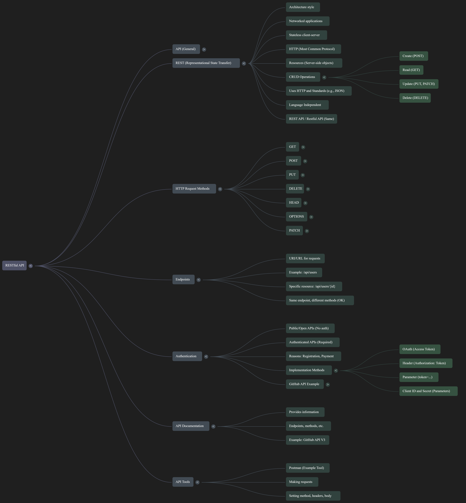

# API notes

## Introduction

- The video is the 39th in the "**Chai aur Javascript**" series on the "Chai aur Code" YouTube channel.

## Backend  

The backend is the part of a system that runs on a server and handles data storage, business logic, authentication, and other core functions. It typically exposes APIs that other components (like frontends) can call to retrieve or modify data.

## Frontend  

The frontend is the client‑side part that users interact with directly—usually a web page, mobile app, or desktop UI. It sends requests to the backend’s APIs and presents the returned data to the user.  

**In short:** the backend provides services and data; the frontend consumes those services and displays them to the user.

## What is an API?

- An **API** is a **talking language between two systems**.
- These systems can be **backend and frontend**, two backends, two frontends, or combinations from different entities.
- APIs facilitate communication between systems written in different languages (e.g., Java and Javascript).

## Examples of APIs

- **GitHub API (`api.github.com`)**: Provides access to public information like username, company name, website, followers, etc.
  - The data is typically returned in a **large object** with values.
  - Example URL: `api.github.com/users/{username}`.
- **Random User API (`randomuser.me`)**: Another popular API that provides random user data.
  - Offers different ways to access data, including **AJAX calls**.
  - API responses can be complex, requiring inspection to understand the structure.

## Understanding API Structures

- API responses can be large and have nested structures.
- Tools like **JSON formatter websites (e.g., `jsonformatter.org`)** are helpful for understanding the structure.
- By pasting the API response into a JSON formatter, you can **format and validate** the data.
- These tools often provide different views like **Tree View**, making it easier to see the object hierarchy and array structures.
- You can identify properties and how to access nested values (e.g., `data.results.name.first`).
- Understanding API structures requires time and effort; there are no shortcuts.
- You need to **actually interact with the API and format the response** to truly understand it.

## Making API Requests(before Fetch API): `XMLHttpRequest`

- The video will first cover the **traditional way of making API requests** using **`XMLHttpRequest`** before discussing `fetch` in the next video.
- `fetch` is relatively new.
- **`XMLHttpRequest` is a legacy API** but still works and is used in some frameworks.
- It involves creating an **`XMLHttpRequest` object**.

```javascript
let xhr = new XMLHttpRequest();
```

- The `XMLHttpRequest` object has properties like `readyState` and `responseText`.
- The **`open()`** method initializes a request, taking the **HTTP method** (e.g., GET, POST) and the **URL** as parameters.

```javascript
let requestURL = "https://api.github.com/users/hiteshchoudhary";
xhr.open('GET', requestURL);
```

- The **`send()`** method actually sends the request.

```javascript
xhr.send();
```

- The **`readyState`** property indicates the state of the request. The possible states are:
  - 0: **UNSENT** (client created, `open()` not called).
  - 1: **OPENED** (`open()` called, request sent).
  - 2: **HEADERS_RECEIVED** (headers received).
  - 3: **LOADING** (response loading).
  - 4: **DONE** (operation complete).
- The **`onreadystatechange`** event handler function is called every time the `readyState` changes.

```javascript
xhr.onreadystatechange = function() {
  console.log(xhr.readyState);
};
```

- **Accessing `responseText`:** The `responseText` becomes available when the **`readyState` of the `XMLHttpRequest` object reaches 4**, which signifies that the **operation is complete**. You access it within the **`onreadystatechange` event handler function**.

```javascript
xhr.onreadystatechange = function() {
  if (this.readyState === 4) {
    console.log(this.responseText);
  }
};
```

The sources explain that when making traditional API requests using `XMLHttpRequest`, the **`responseText`** property of the `XMLHttpRequest` object holds the **data received from the server as a string**.

- **Format of `responseText`:** The source explicitly states that the **`responseText` is typically a string**, even if it looks like a JSON object. This is illustrated when the code attempts to access `data.followers` directly after assigning `this.responseText` to the `data` variable, resulting in `undefined`.

```javascript
xhr.onreadystatechange = function() {
  if (this.readyState === 4) {
    let data = this.responseText;
    console.log(typeof data); // Output: string
    console.log(data.followers); // Output: undefined
  }
};
```

- **Parsing `responseText` with `JSON.parse()`:** To work with the data as a Javascript object, you need to **parse the `responseText` string using the `JSON.parse()` method**. This conversion transforms the string representation of the JSON data into an actual Javascript object that you can then access using dot notation or bracket notation.

```javascript
xhr.onreadystatechange = function() {
  if (this.readyState === 4) {
    let data = JSON.parse(this.responseText);
    console.log(typeof data); // Output: object
    console.log(data.followers); // Now you can access properties
  }
};
```

- **Context within API Requests:** In the context of making API requests using `XMLHttpRequest`, the `responseText` is the crucial part that carries the actual information you requested from the API. After successfully sending a request and receiving a complete response (`readyState === 4`), the `responseText` contains the body of the HTTP response. This body often contains data in a format like JSON, which needs to be processed to be useful in your Javascript application. The video uses the example of the GitHub API, where the `responseText` would be a JSON string containing details about a user (like followers, profile picture URL, etc.).

## HTTP Basics

- The fundamental difference between **HTTP and HTTPS** is that data in HTTP is mostly sent in **clear text**, while HTTPS encrypts the data for secure transmission.
- Despite the prevalence of HTTPS, the term **HTTP is still commonly used** in books and research papers for convenience.
- **HTTP stands for Hyper Text Transfer Protocol** and deals with how text (in various formats) is transferred.
- The core of internet activity is the **transfer of text or any data** efficiently, considering various variables.
- This involves concepts from **Data Structures and Algorithms (DSA)** for efficient data transfer, **Operating Systems (OS)** for data handling and processing, and **Networking** for communication between computers.
- The interaction typically occurs between a **client (e.g., a mobile app) and a server**. This is known as the **client-server model**.

### URLs, URIs, and URNs

- These terms are related but have slight differences.
- **URL (Uniform Resource Locator)** specifies the **location** of a resource. It identifies **where to communicate** to access a resource.
- Not all identifiers in location have "http" at the beginning; other protocols like those used in MongoDB (e.g., SRV) exist. **HTTP is just one of many communication protocols**.
- **URI (Uniform Resource Identifier)** is a more accurate technical name for identifying resources.
- Professionals in tech companies often use **URL and URI** more frequently than just "address".

### HTTP Headers

- When an HTTP request is sent, **additional information** is sent along with it, similar to metadata accompanying a file (name, size, creation date, etc.).
- **HTTP headers are metadata** about the data being transferred.
- Headers consist of **key-value pairs**, e.g., "Name: Hitesh".
- The structure of HTTP headers is quite **open**, allowing for a lot of flexibility.
- While some headers are **predefined**, developers can also create their **own custom headers**.
- Headers are present in both **HTTP requests** (sent from the client to the server) and **HTTP responses** (sent from the server to the client).
- Request headers can vary depending on whether the request is sent programmatically, through tools like Postman or Thunder Client, or by a browser.
- Response headers depend on the server's reply (e.g., "OK" or "404 Not Found").
- **Headers have various functions**, not just one specific purpose.

#### Functions of HTTP Headers

- **Caching**: Used to check if a previous response can be retrieved from a cache.
- **Authentication**: Used to pass authentication information, such as **Bearer tokens, session cookies, and refresh tokens**.
- **State Management**: Used to manage the user's state, such as whether they are a guest or logged-in user, or if they have items in a cart.

#### Historical Note on Header Prefixes

- Before around **2012-2013**, it was often necessary to use the **"X-" prefix** for custom headers (e.g., "X-Name").
- This convention is now mostly **deprecated**, and the "X-" prefix is generally not used anymore. However, it might still be found in older codebases.

#### Categories of HTTP Headers

- While not officially categorized, headers can be broadly grouped as follows:
  - **Request Headers**: Information sent from the **client** to the server.
  - **Response Headers**: Information sent from the **server** to the client. **Standardization is crucial** for response codes (e.g., "OK" should have a consistent code across servers). While custom codes can be used, it's not standard practice.
  - **Representation Headers**: Describe the format of the data, such as **encoding and compression** (e.g., GZIP). This is important when dealing with compressed data, especially in mobile apps and applications using graph charts (like Zerodha or Razorpay), to optimize network usage.
  - **Payload Headers**: "Payload" is a term for the **actual data** being sent, such as user IDs or email addresses.

- There can be other categorizations, such as security headers, etc.

#### Common HTTP Headers

- **Accept**: Indicates the **types of data the client can accept** from the server. A common value is `application/json`, but others like `text/html` also exist.
- **User-Agent**: Identifies the **application making the request** (e.g., browser name and version, operating system, Postman). This information is used by websites to tailor content or suggest using their mobile app if the request comes from a mobile browser.
- **Authorization**: Used for **authentication**, often containing a **Bearer token** (typically a JWT - JSON Web Token) in the format "Bearer [token]".
- **Content-Type**: Specifies the **type of data** being sent in the request body (e.g., images, PDF).
- **Cookies**: Key-value pairs that store information on the client-side to maintain **user sessions and track user state**. They can contain unique codes and expiry times.
- **Cache-Control**: Manages **caching behavior**, specifying when data should expire in the network (e.g., after 3600 seconds).
- **CORS Headers (Cross-Origin Resource Sharing)** and **Security Headers**: Used in production-grade applications to define internal company policies regarding allowed origins and security measures. These headers themselves don't enforce policies automatically; server-side code needs to implement the logic based on these headers.

### HTTP Methods

- HTTP methods indicate the **operations to be performed** on a resource.
- Opening the dropdown in tools like Postman reveals a long list of available HTTP methods.
- Common methods include:
  - **GET**: Used to **retrieve a resource** from the server. It can be used to fetch all users or a specific user based on criteria like email.
  - **POST**: The **most common method**, used to **interact with a resource**, often to **add new data**, such as a new user, product, or category.
  - **PUT**: Used to **replace an entire resource** at a given URI. It's used when you want to overwrite the complete object.
  - **DELETE**: Used to **remove a resource** from the server.

- Other methods:  
  - **PATCH**: Used to **update a part of a resource** without replacing the entire resource. It allows for modifying specific fields.
  - **HEAD**: Similar to GET but **does not return a message body**. It only returns the **HTTP headers**, useful for checking metadata like user agent or cache control.
  - **OPTIONS**: Used to **query the server about the available HTTP methods and other options** for a specific endpoint (e.g., "/users" might allow POST and GET). It requires explicit endpoint configuration.
  - **TRACE**: Primarily used for **debugging**. It performs a **loop-back** of the request, returning exactly what was sent. It helps in identifying the proxies involved in the request path if a resource is behind multiple proxies, useful for debugging latency issues.

- Many other HTTP methods exist; exploring tools like Postman or consulting resources can provide a comprehensive list.

### HTTP Status Codes

- HTTP status codes are a **standardized way for the server to communicate the outcome of a client's request**.
- A basic overview of status codes is important for back-end developers, though memorizing every code is not necessary.
- The first digit of the status code indicates the general category:
  - **1xx (Informational)**: Used to convey **provisional or informational responses**. Examples include 100 (Continue) and 102 (Processing). 102 indicates the server is processing a request that might take a long time, providing a response to the client after a few seconds to indicate ongoing processing.
  - **2xx (Success)**: Indicates that the client's request was **successfully received, understood, and accepted**. Examples include 200 (OK) for a successful request, 201 (Created) when a resource is successfully created, and 202 (Accepted) indicating the request has been accepted for processing but not yet completed.
  - **3xx (Redirection)**: Indicates that the client needs to take further action to complete the request, often by **redirecting to a different URI**. Examples include 307 (Temporary Redirect) and 308 (Permanent Redirect).
  - **4xx (Client Error)**: Indicates that the client's request **contained an error**. Examples include 400 (Bad Request) for malformed requests, 401 (Unauthorized) when authentication is required and has failed or has not yet been provided, 402 (Payment Required) often related to payment processing, and 404 (Not Found) when the requested resource could not be found on the server.
  - **5xx (Server Error)**: Indicates that the **server encountered an error** while trying to fulfill the request. Examples include 500 (Internal Server Error) for general server-side errors and 504 (Gateway Timeout) indicating a timeout while waiting for another server to respond.

- While there are standard conventions, individual companies might have their own specific usage of status codes.

### Conclusion

- Understanding these HTTP concepts is **fundamental for back-end development** and helps in writing effective controllers.
- Having a good grasp of these basics differentiates a good programmer from an average one, fostering **curiosity about underlying engineering principles** like network latency and data structure optimization.

## REST API



### What is an API first?

- **API** stands for **Application Program Interface**.
- It's a broad term encompassing various types of APIs, including web APIs, operating system APIs, smartphone APIs, and even APIs in devices like refrigerators.
- An API is essentially a **contract** provided by one piece of software to another.
- It usually involves a **structured request** and a **structured response**.
- One piece of software requests information in a specific format, and the other provides the data or function as a response.

### Analogies for Understanding APIs

#### Restaurant Analogy

- You (client-side software) are at a table in a restaurant.
- The kitchen is the server that processes requests.
- The **waiter** acts like an **API**, taking your order (request) in a specific format and bringing back your meal (response/data).
- The waiter is a **messenger** between running software.

#### Toy Box Analogy

- Imagine a toy box (API) formatted to accept specific shapes: circle, square, or triangle.
- The client must format the request (the shape) according to the API's requirements.
- Incorrectly formatted requests will result in an error message or response.
- The shape can be thought of as the **API standard**, such as **JSON** or **SOAP**.
- The output once a valid shape is inserted represents the **response**.

## What is a RESTful API? Explanation of REST & HTTP (Traversy Media)

**REST API** (Representational State Transfer) is a specific architectural style for building web APIs. It defines constraints such as statelessness, a uniform interface (typically HTTP verbs GET, POST, PUT, DELETE), and resource‑oriented URLs.  

**What “API” covers more broadly**

| Scope | Description |
|-------|-------------|
| **General API** | Any defined interface that allows one software component to interact with another, regardless of protocol, data format, or architecture. Examples: function libraries, OS system calls, GraphQL, gRPC, SOAP, WebSockets, MQTT, etc. |
| **REST API** | A subset of web APIs that follow the REST constraints. It usually exchanges data in JSON or XML over HTTP. |
| **Other web‑API styles** | • **SOAP** – XML‑based, uses a strict envelope and WS‑* standards.<br>• **GraphQL** – single endpoint where clients specify exactly what data they need.<br>• **gRPC** – binary protocol built on HTTP/2, uses Protocol Buffers for schema.<br>• **JSON‑API**, **OData**, **HAL**, etc. – conventions that sit on top of HTTP but are not pure REST. |

So, **REST API is not a catch‑all term**; it refers to one particular way of designing an API. The broader term “API” includes REST as well as many other styles and protocols.

### What is REST?

- **REST** stands for **Representational State Transfer**.
- It is an **architecture style** for designing networked applications.
- REST relies on a **stateless client-server communication protocol**.
- In almost all cases, this protocol is **HTTP**.
- **HTTP** is the foundation of communication on the internet.
- Every time you load a webpage, your browser makes an **HTTP request** to a server.
- While other protocols can be used with REST, HTTP is the most common due to the delivery methods it offers.
- REST was designed to treat objects on the server-side as **resources** that can be **created**, **updated**, and **destroyed** (or deleted).
- Examples of server-side objects include blog posts in a database.
- These resources can be manipulated using HTTP requests like **POST** (create), **DELETE** (destroy), etc..
- A key advantage of REST is that it operates using standard HTTP and often a standard data format like **JSON**, making it usable by virtually any programming language capable of making HTTP requests (e.g., PHP, JavaScript, Rails, Java, Python).
- An API is the messenger, and REST allows us to use HTTP requests to format those messages.
- The terms **REST API** and **restful API** are essentially the same, referring to APIs that conform to REST constraints.

### HTTP Methods/Requests in REST

- **GET Request**:
  - The most common type of request.
  - Your browser makes GET requests daily to retrieve data from a specified resource.
  - Used to **get** or **retrieve data**.
- **POST Request**:
  - Commonly used when filling out web forms.
  - Used to **add** or **create** a new resource on the server.
  - HTML form tags can make POST requests using the `method` attribute set to "post".
- **PUT Request**:
  - Used to **update** a specified resource.
  - Typically requires sending a request to an endpoint (URI/URL) with an ID for the specific resource.
  - Cannot be made directly from a standard HTML form; requires methods like **Ajax**, standard JavaScript, jQuery, or HTTP modules in frameworks like Angular.
- **DELETE Request**:
  - Used to **delete** a specified resource on the server.
  - Requires specifying the ID of the resource to be deleted.
  - Similar to PUT, usually requires methods beyond standard HTML forms.
- **Other HTTP Requests (Less Common)**:
  - **HEAD**: Same as GET but doesn't return the response body; only returns the header information.
  - **OPTIONS**: Used to determine the supported HTTP methods of a server.
  - **PATCH**: Used for partially updating a resource.

### API Endpoints

- **Endpoints** are the **URI** or **URL** where HTTP requests are sent.
- Example base URL: `mysite.com/api`.
- **GET /api/users**: Typically retrieves a list of all users.
- **GET /api/users/{id}**: Retrieves data for a specific user with the given ID. The `{id}` is a placeholder for the actual user ID. Variations like `/api/users/details/{id}` or `/api/users/show/{id}` might also exist.
- **POST /api/users**: Typically adds a new user to the server/database. Note that this endpoint is the same as the GET request for all users but uses a different HTTP method.
- **PUT /api/users/{id}` or `/api/users/update/{id}`**: Updates the user with the specified ID. Requires sending data along with the request.
- **DELETE /api/users/{id}` or `/api/users/delete/{id}`**: Deletes the user with the specified ID.

### API Authentication

- Endpoints without authentication are **public** or **open APIs**.
- Some APIs require **authentication** before use.
- This might involve registering your application with the provider's website and sometimes paying for access.
- Common authentication methods:
  - **OAuth**: Involves obtaining an **access token** and sending it with requests. Attempts without a valid token usually result in an unauthorized error.
  - **Token in Header**: The token is included as a value in the **Authorization** field of the HTTP header.

    ```bash
    curl -H "Authorization: YOUR_TOKEN" https://api.github.com/user
    ```

    >More info on cURL below:

  - **Token as URI Parameter**: The token is sent as a parameter in the URL.

    ```js
    https://api.example.com/data?token=YOUR_TOKEN
    ```

  - **Client ID and Secret as Parameters**: Instead of a direct token, a generated **client ID** and **secret** are sent as parameters.

    ```js
    https://api.example.com/data?client_id=YOUR_CLIENT_ID&client_secret=YOUR_CLIENT_SECRET
    ```

### Real World Example: GitHub API

- GitHub API is presented as a good API for beginners.
- Access without authentication is possible but often limited (e.g., 100 requests per hour for the GitHub API). Exceeding the limit without authorization results in an error.
- **GitHub API Documentation**: Found at `developer.github.com/v3/`. Most APIs have similar documentation detailing endpoints and allowed methods.
- The documentation shows the different HTTP verbs (HEAD, GET, POST, PATCH, PUT, DELETE) available for various endpoints.
- It also details authentication methods, including header and parameter-based authentication.
- **Pagination**: Many APIs, including GitHub's, support pagination to handle large amounts of data by allowing you to request a certain number of items per page and specify the page number.

#### Interacting with the GitHub API

- Tools like **curl** can be used to make HTTP requests.

    ```bash
    curl https://api.github.com/users
    ```

- **Postman** is suggested as a user-friendly tool (Chrome extension/application) for making API requests. It allows setting the endpoint, request type, headers, and request body.
- **GET Request to /users**: Returns an array of user objects with details like username, ID, avatar URL, number of repositories, etc..

    ```js
    GET https://api.github.com/users
    ```

- **GET Request to /users/{username}**: Returns detailed information for a specific user.

    ```js
    GET https://api.github.com/users/octocat
    ```

- **Rate Limiting**: APIs often have rate limits to prevent abuse. The GitHub API enforces these limits. Exceeding the limit results in an error indicating the rate limit has been exceeded.
- **Authentication with Client ID and Secret (GitHub Example)**:
  - To overcome rate limits, you need to register your application on the API provider's website (e.g., `github.com/settings/applications/new` for GitHub).
  - Registration provides a **client ID** and a **client secret**.
  - These can be included as parameters in the API request URL for authentication.

    ```js
    GET https://api.github.com/users/octocat?client_id=YOUR_CLIENT_ID&client_secret=YOUR_CLIENT_SECRET
    ```

- Authenticating allows you to make more requests.

## Fetch API, Async/Await, and Promises (39:25 - 50:20)

### Simple explanation of the FetchAPI Code (uses Promises)

The provided code uses the Fetch API to make an HTTP GET request to the URL `https://jsonplaceholder.typicode.com/users/1`. Here's what it does step by step:

```javascript
fetch('https://jsonplaceholder.typicode.com/users/1')
  .then(response => response.json())
  .then(data => console.log(data))
  .catch(error => console.log(error));
```

1. **`fetch()`**:
   - Sends an HTTP GET request to the specified URL.
   - Returns a `Promise` that resolves to a `Response` object representing the HTTP response.

2. **`response.json()`**:
   - The `Response` object has a `body` property, which is a `ReadableStream` containing the raw response data.
   - The `.json()` method reads the `ReadableStream` and parses it as JSON.
   - It returns a `Promise` that resolves to a JavaScript object (or array) parsed from the JSON data.

3. **`.then(data => console.log(data))`**:
   - Logs the parsed JavaScript object (the JSON data) to the console.

4. **`.catch(error => console.log(error))`**:
   - Catches and logs any errors that occur during the fetch or JSON parsing process.

---

#### What is the Response from `fetch` Originally?

- The original response from `fetch` is a `Response` object. This object contains:
  - Metadata about the response (e.g., HTTP status, headers).
  - The `body` property, which is a `ReadableStream` containing the raw response data.

---

#### What is the Response Converted To?

- The `.json()` method converts the raw response body (a `ReadableStream`) into a JavaScript object or array, depending on the structure of the JSON data.

---

#### What Does the `.json()` Method Do?

- The `.json()` method:
  1. Reads the `ReadableStream` from the `Response` object.
  2. Decodes the stream into text.
  3. Parses the text as JSON.
  4. Returns a `Promise` that resolves to the resulting JavaScript object or array.

---

#### Is This Statement True?

##### **"The json() method converts the ReadableStream into a JavaScript object."**

- **Partially True**:
  - The `.json()` method **reads** the `ReadableStream` and **parses** its content as JSON.
  - However, it does not directly convert the `ReadableStream` into a JavaScript object. Instead:
    1. It reads the stream and converts it into a string (raw JSON text).
    2. It parses the string into a JavaScript object or array.

---

#### Example Response

For the URL `https://jsonplaceholder.typicode.com/users/1`, the JSON response might look like this:

```json
{
  "id": 1,
  "name": "Leanne Graham",
  "username": "Bret",
  "email": "Sincere@april.biz",
  "address": {
    "street": "Kulas Light",
    "suite": "Apt. 556",
    "city": "Gwenborough",
    "zipcode": "92998-3874",
    "geo": {
      "lat": "-37.3159",
      "lng": "81.1496"
    }
  },
  "phone": "1-770-736-8031 x56442",
  "website": "hildegard.org",
  "company": {
    "name": "Romaguera-Crona",
    "catchPhrase": "Multi-layered client-server neural-net",
    "bs": "harness real-time e-markets"
  }
}
```

After `.json()` processes the response, this JSON data is converted into a JavaScript object, which is logged to the console.

### Using Fetch with Async/Await

- The video introduces using the **`fetch` API** within an **`async` function** with **`await`**.
- An example `async` function named `get all users` is created to fetch user data.
- The `fetch()` function is called with a URL (`https://jsonplaceholder.typicode.com/users`), and this call returns a **Promise**.
- The `await` keyword is used before the `fetch()` call. This means the execution of the `get all users` function will pause until the **Promise** returned by `fetch()` is resolved.

```javascript
async function getAllUsers() {
  const response = await fetch('https://jsonplaceholder.typicode.com/users');
  // ... more code
}
```

```javascript
async function getAllUsers() {
  const response = await fetch('https://jsonplaceholder.typicode.com/users');
  const data = await response.json();
  console.log(data);
}
```

`response.json()` is a **convenience method** on the `Response` object that does two things for you:

1. **Reads the response body** as a stream of bytes and converts it to a string.  
2. **Parses that string as JSON** and returns the resulting JavaScript value (object, array, etc.).

So the line

```js
const data = await response.json();
```

is equivalent to:

```js
const text = await response.text();   // get raw JSON string
const data = JSON.parse(text);        // turn the string into an object
```

Using `response.json()` saves you from manually calling `response.text()` (or `response.blob()`) and then invoking `JSON.parse`. It also handles the asynchronous stream reading internally, keeping the code concise and readable.

- The video emphasizes the importance of using **`try...catch` blocks** when using `async/await` with `fetch` to handle potential errors during the network request or JSON parsing.
- Without a `try...catch` block, unhandled rejections in the **Promise** returned by `fetch()` can lead to errors.
- An example of wrapping the `fetch` and `.json()` calls within a `try` block and logging any errors in the `catch` block is shown.

```javascript
async function getAllUsers() {
  try {
    const response = await fetch('https://jsonplaceholder.typicode.com/users');
    const data = await response.json();
    console.log(data);
  } catch (error) {
    console.error("Error:", error);
  }
}
```

### Using Fetch with `.then()` and `.catch()` (Promise Chaining)

- The video demonstrates how to achieve the same data fetching using the traditional **Promise** syntax with `.then()` and `.catch()`.
- The `fetch()` function is called with the URL, returning a **Promise**.
- The first `.then()` callback receives the **Response** object.
- Inside this `.then()` callback, `response.json()` is called, which also returns a **Promise**. This **Promise** is then implicitly returned by the first `.then()`.

```javascript
fetch('https://jsonplaceholder.typicode.com/users')
  .then(response => {
    return response.json();
  })
  // ... more then and catch
```

- A second `.then()` callback is chained to the first one. This second `.then()` receives the resolved value of the **Promise** returned by `response.json()`, which is the actual JSON data.
- The JSON data can then be accessed and processed within this second `.then()` callback.

```javascript
fetch('https://jsonplaceholder.typicode.com/users')
  .then(response => {
    return response.json();
  })
  .then(data => {
    console.log(data);
  })
  // ... catch
```

- The `.catch()` method is used to handle any errors that occur during the **Promise** chain, such as network issues or errors in the `.then()` callbacks.

```javascript
fetch('https://jsonplaceholder.typicode.com/users')
  .then(response => {
    return response.json();
  })
  .then(data => {
    console.log(data);
  })
  .catch(error => {
    console.log("Error", error);
  });
```

### Order of Execution and Asynchronous Nature

- The video points out an interesting observation regarding the order of execution. Even though the `fetch` call is written later in the code, the asynchronous operations initiated by earlier parts of the script (like `setTimeout`) might still be pending when the `fetch` request completes and logs its result first.
- This illustrates the **non-blocking nature** of asynchronous JavaScript operations. The `fetch` API initiates a network request and doesn't block the main thread, allowing other code to potentially execute before the response is received.
- The **Promise** mechanism and `async/await` provide ways to manage and handle the results of these asynchronous operations once they complete.
- The presenter mentions that a more theoretical explanation of why `fetch` might complete before other seemingly earlier asynchronous tasks will be discussed in the next video, involving browser internals and event loops.
- The video concludes by stating that the concepts of **Promises** and `async/await` are fundamental for starting projects or learning frameworks like React and React Native.

# More Info

## `console.log` and the V8 Engine

- The **`console` object and its methods like `console.log` are not technically part of core Javascript** as defined in the ECMAScript standard.
- They are part of the **runtime environment** (e.g., browser, Node.js).
- Similarly, **`document` (used for DOM manipulation) is also not a core Javascript feature** but provided by the browser environment.
- **`console` is a debugging tool** provided by the browser's developer tools.
- Javascript runtime environments like browsers and Node.js use **Javascript engines** to execute Javascript code.
- **V8 is a popular Javascript engine used by Chrome and Node.js**, written in **C++**.
- The **V8 engine's repository is publicly available** ([https://github.com/v8/v8](https://github.com/v8/v8)).
- The V8 engine provides **debugging tools and API access** to the runtime environment.
- The **implementation of `console.log` can be found within the V8 engine's source code**, specifically in files like `d8/console.cc` and `d8/console.h`.
- `d8` is a developer shell for V8.
- The `console.cc` file contains the C++ implementation of `console.log`, which essentially **writes to a file** that the browser's developer console then displays.
- Other `console` methods like `console.error` and `console.warn` are also implemented similarly.
- The `WriteToFile` method in `console.cc` is responsible for the core functionality of `console.log`.

## curl command

**cURL** (Client URL) is a command‑line tool that transfers data to or from a server using many supported protocols (HTTP, HTTPS, FTP, SFTP, etc.). It is available on Linux, macOS, Windows (via the built‑in Windows 10+ `curl.exe` or through packages such as Git for Windows).

### What it usually does

- **Send HTTP requests** (GET, POST, PUT, DELETE, PATCH, HEAD, etc.)  
- **Add headers** (e.g., authentication, content‑type)  
- **Send request bodies** (JSON, form data, files)  
- **Receive and display the response** (status line, headers, body)  
- **Save output to a file** (`-o filename`) or pipe it to other commands for further processing.

### Basic syntax

```bash
curl [options] <URL>
```

### Common options

| Option | Purpose |
|--------|---------|
| `-X <METHOD>` | Specify HTTP method (GET is default). |
| `-H "<header>"` | Add a request header. |
| `-d "<data>"` | Send data in the request body (implies `POST`). |
| `-u user:pass` | Basic authentication. |
| `-o <file>` | Write response body to a file. |
| `-i` | Include response headers in the output. |
| `-s` | Silent mode (no progress meter). |
| `-L` | Follow redirects. |

### Example explanations

```bash
curl https://api.github.com/users
```

- Sends a **GET** request to the GitHub API endpoint that lists public users.  
- The response (JSON) is printed to the terminal.

```bash
curl -H "Authorization: YOUR_TOKEN" https://api.github.com/user
```

- Adds an **Authorization** header containing a personal access token.  
- Calls the `/user` endpoint, which returns information about the authenticated user.  
- Without the header the request would be unauthenticated and return an error.

### Typical workflow

1. **Compose the request** (method, URL, headers, body).  
2. **Run `curl`** from the terminal.  
3. **Inspect the output** (status code, JSON/XML payload).  
4. Optionally **pipe** the output to tools like `jq` for JSON parsing:

   ```bash
   curl -s -H "Authorization: token $TOKEN" \
        https://api.github.com/user | jq .
   ```

cURL is a quick way to test APIs, download files, or automate web interactions from scripts.
