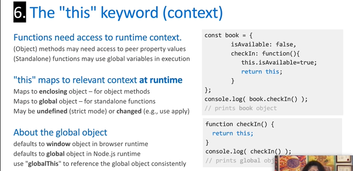

# My Doubts in JavaScript series

<!-- Started with v42_JSON.js, then generalised to objects & related stuff -->

## Questions - Part 1

1) what is "new" in new Object
2) why is typeof result object for array also?
3) what is Array.isArray()? what else like this?
4) - a) what is .length in parsed.length?
   - b) how is .author different in parsed[1].author?
   - c) is there a ".anything" of use besides .log for console.log?

## Answers - Part 1

### 1) **What is "new" in `new Object`?**

- The `new` keyword is used to create an instance of an object or a constructor function. In this case, `new Object()` creates a new object instance.
- Example:

  ```javascript
  const obj = new Object({ key: "value" });
  ```

  This is equivalent to:

  ```javascript
  const obj = { key: "value" };
  ```

  Using `new Object()` is less common because object literals (`{}`) are simpler and more concise.

---

### 2) **Why is `typeof` result `object` for an array also?**

- In JavaScript, arrays are technically a type of object. When you use `typeof` on an array, it returns `"object"`.
- To specifically check if something is an array, you can use `Array.isArray()`.

---

### 3) **What is `Array.isArray()`? What else like this?**

- `Array.isArray()` is a method to check if a value is an array. It returns `true` if the value is an array, otherwise `false`.

  ```javascript
  console.log(Array.isArray([1, 2, 3])); // true
  console.log(Array.isArray({}));       // false
  ```

- Other similar utility methods:
  - `Object.keys(obj)` - Returns an array of keys in an object.
  - `Object.values(obj)` - Returns an array of values in an object.
  - `Object.entries(obj)` - Returns an array of key-value pairs in an object.

---

### 4a) **What is `.length` in `parsed.length`?**

- `.length` is a property that gives the number of elements in an array.

  ```javascript
  const arr = [1, 2, 3];
  console.log(arr.length); // 3
  ```

- If `parsed` is not an array, `parsed.length` will be `undefined`.

---

### 4b) **How is `.author` different in `parsed[1].author`?**

- `parsed[1]` accesses the second element of the array (index 1).
- `.author` accesses the `author` property of that object.

  ```javascript
  const books = [
    { title: "1984", author: "George Orwell" },
    { title: "Becoming", author: "Michelle Obama" }
  ];
  console.log(books[1].author); // "Michelle Obama"
  ```

---

### 4c) **Is there a `.anything` of use besides `.log` for `console.log`?**

- Yes, the `console` object has many useful methods:
  - `console.error()` - Logs an error message.
  - `console.warn()` - Logs a warning message.
  - `console.info()` - Logs an informational message.
  - `console.table()` - Displays data as a table.
  - `console.time()` / `console.timeEnd()` - Measures time between calls.
  - `console.group()` / `console.groupEnd()` - Groups logs together.

Example:

```javascript
console.error("This is an error!");
console.table([{ name: "Alice" }, { name: "Bob" }]);
```

## Questions - Part 2

1) What are objects? How many ways to create them? How are they different from constructor functions?
2) Differentiate between methods & properties
3) typeof, instanceof, Array.isArray(), etc when to use what? Anything else?

## Answers -Part 2

### 1) **What are objects? How many ways to create them? How are they different from constructor functions?**

- **Objects**: Objects in JavaScript are collections of key-value pairs. Keys are strings (or symbols), and values can be any data type, including functions.

- **Ways to create objects**:
  1. **Object Literals**:

     ```javascript
     const obj = { key: "value" };
     ```

  2. **`new Object()`**:

     ```javascript
     const obj = new Object();
     obj.key = "value";
     ```

  3. **Object.create()**:

     ```javascript
     const proto = { greet: "hello" };
     const obj = Object.create(proto);
     ```

  4. **Constructor Functions**:

     ```javascript
     function Person(name) {
       this.name = name;
     }
     const person = new Person("Alice");
     ```

  5. **ES6 Classes**:

     ```javascript
     class Person {
       constructor(name) {
         this.name = name;
       }
     }
     const person = new Person("Alice");
     ```

  6. **Using JSON**:

     ```javascript
     const obj = JSON.parse('{"key": "value"}');
     ```

- **Difference from Constructor Functions**:
  - Objects are standalone entities, while constructor functions are templates to create multiple objects with shared properties/methods.
  - Constructor functions use the `new` keyword to instantiate objects.

---

### 2) **Differentiate between methods & properties**

- **Properties**: Variables attached to an object. They store data.

  ```javascript
  const obj = { name: "Alice" }; // `name` is a property
  console.log(obj.name); // "Alice"
  ```

- **Methods**: Functions attached to an object. They perform actions.

  ```javascript
  const obj = {
    greet: function () {
      return "Hello!";
    },
  };
  console.log(obj.greet()); // "Hello!"
  ```

- **Key Difference**:
  - Properties hold data.
  - Methods perform actions or computations.

---

### 3) **`typeof`, `instanceof`, `Array.isArray()`, etc. When to use what? Anything else?**

- **`typeof`**:
  - Use to check the type of a value.
  - Example:

    ```javascript
    console.log(typeof "hello"); // "string"
    console.log(typeof 42);      // "number"
    console.log(typeof []);      // "object" (arrays are objects)
    ```

- **`instanceof`**:
  - Use to check if an object is an instance of a specific class or constructor.
  - Example:

    ```javascript
    const arr = [];
    console.log(arr instanceof Array); // true
    console.log(arr instanceof Object); // true
    ```

- **`Array.isArray()`**:
  - Use to specifically check if a value is an array.
  - Example:
  
    ```javascript
    console.log(Array.isArray([])); // true
    console.log(Array.isArray({})); // false
    ```

- **Other Utility Methods**:
  - `Object.keys(obj)` - Get an array of keys.
  - `Object.values(obj)` - Get an array of values.
  - `Object.entries(obj)` - Get an array of key-value pairs.
  - `isNaN(value)` - Check if a value is `NaN`.
  - `Number.isFinite(value)` - Check if a value is a finite number.

- **When to use what**:
  - Use `typeof` for primitive types.
  - Use `instanceof` for class or constructor checks.
  - Use `Array.isArray()` for arrays.
  - Use `Object.keys/values/entries` for object manipulation.

## Questions - Part 3

When understanding objects in Javascript, the following doubts came up:

1. Object Creation: literal vs constructor. my instructor said initially literals are easier to grasp but constructors or object prototypes have various more uses (something about inheritance).
2. Accessing/invoking properties & methods: Dot & bracket notation. Something was said about "like with namespaces" for dot notation & "like with hashmaps" for bracket notation.
3. The "this" keyword for context totally went over my head. I am attaching image for you to explain "this" keyword from the image to me from an easy level.

## Answers - Part 3

## 1. **Object Creation**: Literal vs. Constructor (Prototypes)

### **Object Literal**

- **Definition**: An easy, direct way to create objects using curly braces:

  ```js
  const person = {
    name: "Alice",
    greet: function () {
      console.log(`Hello, I am ${this.name}`);
    },
  };
  ```

- **Use Case**: Great for **simple** or **one-off** objects (configuration objects, quick grouping of data, etc.).

### **Constructor Function (Prototypes)**

- **Definition**: A function designed to create multiple similar objects. Used with the `new` keyword:

  ```js
  function Person(name) {
    this.name = name;
    this.greet = function() {
      console.log(`Hello, I am ${this.name}`);
    };
  }

  const alice = new Person("Alice");
  const bob = new Person("Bob");
  ```

- **Use Case**: Handy for **creating many objects** that share properties and methods, especially when you want to leverage **prototypes** (JavaScript’s inheritance mechanism).

In modern JavaScript, you often see **classes** (syntactic sugar over constructor functions):

```js
class Person {
  constructor(name) {
    this.name = name;
  }
  greet() {
    console.log(`Hello, I am ${this.name}`);
  }
}
```

Either way, the **key advantage** of constructor functions or classes is the ability to reuse code and create many similar objects without rewriting property and method definitions.

---

## 2. **Accessing/Invoking Properties & Methods**: Dot vs. Bracket Notation

### **Dot Notation** (`object.property`)

- **Similar to Namespaces**: `object.property` is direct and simple.
- **When to Use**:  
  - If the property name is a **valid identifier** (letters, numbers, underscores, no spaces).
  - When you know the property name **at code time**.

### **Bracket Notation** (`object["property"]`)

- **Similar to a Hash Map or Dictionary**: `object["property"]` is more flexible.
- **When to Use**:
  - Property name has **special characters** or **spaces**: `object["some weird key"]`.
  - Property name is **dynamic**:

    ```js
    const key = "name";
    console.log(object[key]); // object["name"]
    ```

In short, **dot notation** is more common and concise, but **bracket notation** is needed for dynamic or unusual property names.

---

## 3. **The `this` Keyword** (Context)



From the attached image above, you can see references to how `this` depends on **where and how** a function is called. Let’s simplify:

### **What Does `this` Mean?**

- `this` is essentially a **placeholder** for the **current execution context**.  
- In a method (a function inside an object), `this` usually refers to **the object that owns the method**.

### **Key Points in the Image**

1. **Methods Need Access to Runtime Context**  
   - If you have an object like:

     ```js
     const book = {
       isAvailable: false,
       checkIn: function() {
         this.isAvailable = true;
         return this;
       }
     };
     ```

     - Here, `this` inside `checkIn()` refers to the `book` object.  
     - That’s why `this.isAvailable` modifies `book.isAvailable`.

2. **Standalone Functions**

   ```js
   function checkIn() {
     return this;
   }
   ```

   - In **non-strict** mode (older JavaScript defaults), calling `checkIn()` without an object makes `this` refer to the **global object** (in browsers, `window`; in Node, `global`).  
   - In **strict mode**, `this` is `undefined` for standalone functions unless you explicitly bind or call it with a specific context.

3. **`this` Can Change**  
   - Using methods like `call()`, `apply()`, or `bind()`, you can force `this` to be whatever object you want.
   - For example:

     ```js
     const anotherBook = { isAvailable: false };
     function checkIn() {
       this.isAvailable = true;
     }
     checkIn.call(anotherBook); // 'this' inside checkIn refers to 'anotherBook'
     ```

4. **Global Object**  
   - In a browser, that’s typically `window`.
   - In Node.js, it’s `global`.
   - ES2020 introduced `globalThis` as a universal reference to the global object across different environments.

#### **In the Example from the Image**

```js
const book = {
  isAvailable: false,
  checkIn: function() {
    this.isAvailable = true;
    return this;
  }
};

console.log(book.checkIn());
// prints the 'book' object, because 'this' is 'book'
```

```js
function checkIn() {
  return this;
}

console.log(checkIn());
// prints the global object or 'undefined' in strict mode
```

- **Inside `book.checkIn()`**: `this` → the `book` object.  
- **Inside the standalone `checkIn()`**: `this` → the global object (or `undefined` in strict mode).

---

## Putting It All Together

1. **Object Creation**  
   - Use **literals** for quick or small objects.  
   - Use **constructor functions** (or **classes**) for multiple instances with shared behavior.

2. **Property & Method Access**  
   - Use **dot notation** for simple, known property names.  
   - Use **bracket notation** for dynamic or unusual names.

3. **`this` Keyword**  
   - It’s about **context**. Inside an object’s method, `this` points to the object.  
   - In a standalone function, it may point to the global object or `undefined` in strict mode.  
   - Tools like `call()`, `apply()`, and `bind()` can explicitly set `this`.

## Questions - Part 4

Two variables were named the same 'book' in v44objects.js gave error:
Cannot redeclare block-scoped variable 'book'.

## Answers - Part 4

The error **"Cannot redeclare block-scoped variable 'book'"** occurs when you attempt to declare a variable with the same name more than once in the same scope using `let` or `const`. These keywords enforce block scoping, meaning the variable is confined to the block in which it is declared and cannot be redeclared within that scope.

Solution: 4th method used from "How to fix" below in v44objects.js

### Common Causes

1. **Duplicate Declarations**:
   You may have declared `book` multiple times in the same block or file.

   ```javascript
   let book = "First declaration";
   let book = "Second declaration"; // Error: Cannot redeclare block-scoped variable 'book'
   ```

2. **Global Scope Collision**:
   If `book` is declared in the global scope (e.g., without a module system), it might conflict with another declaration in the same file or another script.

3. **Re-running Code in Development**:
   In environments like Visual Studio Code's integrated terminal or browser dev tools, re-running a script without refreshing the environment can cause this error if the variable was already declared.

---

### How to Fix

1. **Check for Duplicate Declarations**:
   Search the file for all instances of `book` and ensure it is declared only once in the same scope.

   ```javascript
   let book = "First declaration";
   // Remove or reuse the variable instead of redeclaring it
   book = "Updated value";
   ```

2. **Use `var` if Redeclaration is Intentional**:
   If you need to redeclare the variable (not recommended), use `var` instead of `let` or `const`. However, this is discouraged because `var` has function scope, which can lead to bugs.

   ```javascript
   var book = "First declaration";
   var book = "Second declaration"; // No error, but not ideal
   ```

3. **Use `const` for Immutable Variables**:
   If `book` should not change, use `const` and ensure it is declared only once.

   ```javascript
   const book = "Immutable value";
   ```

4. **Wrap Code in a Block or Function**:
   If the variable is declared in different scopes, wrap each declaration in its own block or function to avoid conflicts.

   ```javascript
   {
       let book = "First block";
       console.log(book);
   }

   {
       let book = "Second block";
       console.log(book);
   }
   ```

---

### Debugging in Visual Studio Code

1. Use the **Find** feature (`Ctrl+F` or `Cmd+F`) to search for all instances of `book` in your file.
2. If you're working in a Node.js or browser environment, ensure you're not re-running the same script without restarting the environment.

## Questions - Part 5

For the `this` keyword, explain in easy ways the theory & working of lines 105-119 of code in v44objects.js

## Answers - Part 5

### Code Breakdown

#### 1. **Defining an Object with a Method Using `this`**

```javascript
const bookObj = {
    checkIn: function(){
        return this;
    }
}
```

- `bookObj` is an object with a method `checkIn`.
- Inside the `checkIn` method, `this` refers to the object that owns the method, which is `bookObj` in this case.

#### 2. **Testing `this` in the Object's Method**

```javascript
console.log("\n\nthis is: ", bookObj.checkIn()); 
console.log(bookObj.checkIn() === globalThis);
console.log(bookObj.checkIn() === bookObj);
```

- `bookObj.checkIn()` returns `this`, which is the `bookObj` itself.
- `bookObj.checkIn() === globalThis` checks if `this` refers to the global object (`globalThis` in modern JavaScript). This will return `false` because `this` inside the method refers to `bookObj`, not the global object.
- `bookObj.checkIn() === bookObj` checks if `this` refers to `bookObj`. This will return `true`.

---

#### 3. **Defining a Standalone Function**

```javascript
function anotherCheckIn () {
    return this;
}
```

- `anotherCheckIn` is a standalone function, not part of any object.
- When called, `this` inside the function refers to the global object (`globalThis`) in non-strict mode.

#### 4. **Testing `this` in the Standalone Function**

```javascript
console.log("\n\nthis is: ", anotherCheckIn()); 
console.log(anotherCheckIn() === globalThis);
```

- `anotherCheckIn()` returns `this`, which is the global object (`globalThis`) in non-strict mode.
- `anotherCheckIn() === globalThis` checks if `this` refers to the global object. This will return `true`.

---

### Key Concepts

1. **`this` in an Object's Method**:
   - Refers to the object that owns the method (e.g., `bookObj`).

2. **`this` in a Standalone Function**:
   - Refers to the global object (`globalThis`) in non-strict mode.
   - In strict mode, `this` would be `undefined`.

3. **Global Context**:
   - Outside of any object or function, `this` refers to the global object (`globalThis`).

---

### Output of the Code

1. `bookObj.checkIn()` returns `bookObj`.
2. `bookObj.checkIn() === globalThis` is `false`.
3. `bookObj.checkIn() === bookObj` is `true`.
4. `anotherCheckIn()` returns `globalThis`.
5. `anotherCheckIn() === globalThis` is `true`.

This demonstrates how `this` behaves differently depending on the context in which it is used.

## Questions - Part 6

Explain the concepts involved in the v46promises.js code.

## Answers - Part 6

This code demonstrates the use of **JavaScript Promises**, which are a way to handle asynchronous operations.

### 1. **What is a Promise?**

A Promise in JavaScript is an object that represents the eventual completion (or failure) of an asynchronous operation and its resulting value. It has three states:

- **Pending**: The operation is still in progress.
- **Fulfilled**: The operation completed successfully.
- **Rejected**: The operation failed.

### 2. **The `promiseTimeout` Function**

```javascript
function promiseTimeout(ms) {
    return new Promise((resolve, reject) => {
        setTimeout(resolve, ms);
        // setTimeout(reject, ms); 
        // Uncomment to test rejection & comment the resolve
    });
}
```

- This function creates and returns a new Promise.
- Inside the Promise, the `setTimeout` function is used to simulate a delay of `ms` milliseconds.
- After the delay, the `resolve` function is called, which fulfills the Promise.
- If you uncomment the `reject` line and comment out `resolve`, the Promise will be rejected instead.

### 3. **Chaining Promises**

```javascript
promiseTimeout(2000)
    .then(() => {
        console.log('Done!!');
        return promiseTimeout(1000);
    }).then(() => {
        console.log('Also done!');
        return Promise.resolve(42);
    }).then((result) => {
        console.log(result);
    }).catch(() => {
        console.log('Error!');
    });
```

- **`promiseTimeout(2000)`**: This starts a Promise that resolves after 2 seconds.
- **`.then()`**: This method is used to handle the fulfillment of a Promise. It takes a callback function that runs when the Promise resolves.
  - The first `.then()` logs `'Done!!'` and starts another Promise with a 1-second delay.
  - The second `.then()` logs `'Also done!'` and returns a resolved Promise with the value `42`.
  - The third `.then()` receives the value `42` and logs it.
- **`.catch()`**: This method is used to handle errors (rejections). If any Promise in the chain is rejected, the `.catch()` block will run.

### 4. **Key Concepts**

- **Asynchronous Execution**: Promises allow you to write asynchronous code that looks more like synchronous code, making it easier to read and maintain.
- **Chaining**: You can chain multiple `.then()` calls to handle sequential asynchronous operations.
- **Error Handling**: The `.catch()` block ensures that errors are caught and handled gracefully.

### 5. **Output of the Code**

If you run the code as it is:

1. After 2 seconds, it logs: `Done!!`
2. After another 1 second, it logs: `Also done!`
3. Finally, it logs: `42`

If you uncomment the `reject` line and comment out `resolve`, the `.catch()` block will run, and it will log: `Error!`.

## Questions - Part 7

Explain the theory involved in v48async_await.js (especially async await). Also, help me understand the flow of execution of code.

## Answers - Part 7

### **1. What is `async` and `await`?**

- **`async`**: Declares a function as asynchronous. An `async` function always returns a Promise, even if you don't explicitly return one.
- **`await`**: Pauses the execution of an `async` function until the Promise it is waiting for is resolved or rejected. It allows you to write asynchronous code in a synchronous style, making it easier to read and understand.

---

### **2. Code Breakdown**

#### **`promiseTimeout` Function**

```javascript
function promiseTimeout(ms) {
    return new Promise((resolve, reject) => {
        setTimeout(resolve, ms);
    });
}
```

- This function creates a Promise that resolves after `ms` milliseconds using `setTimeout`.
- It simulates a delay.

#### **`longRunningOperation` Function**

```javascript
async function longRunningOperation() {
    // logic here, say calling a server - something that takes time
    return 42;
}
```

- This is an `async` function that simulates a long-running operation (e.g., fetching data from a server).
- It returns the value `42`. Since it's an `async` function, it implicitly wraps the return value in a Promise. So, calling this function returns `Promise { 42 }`.

#### **`run` Function**

```javascript
async function run() {
    console.log('Start!!');
    await promiseTimeout(2000);
    const response = await longRunningOperation();
    console.log(response);
    console.log('Stop!!');
}
```

- **`console.log('Start!!')`**: Logs "Start!!" to the console.
- **`await promiseTimeout(2000)`**: Pauses the execution of the `run` function for 2 seconds until the Promise returned by `promiseTimeout` resolves.
- **`const response = await longRunningOperation()`**: Waits for the `longRunningOperation` function to resolve and assigns the resolved value (`42`) to the `response` variable.
- **`console.log(response)`**: Logs the value of `response` (which is `42`).
- **`console.log('Stop!!')`**: Logs "Stop!!" to the console.

---

### **3. Flow of Execution**

1. The `run` function is called.
2. **Step 1**: Logs `"Start!!"` to the console.
3. **Step 2**: Encounters `await promiseTimeout(2000)`. The function pauses for 2 seconds while the Promise resolves.
4. **Step 3**: After 2 seconds, execution resumes. It encounters `await longRunningOperation()`. The function pauses again until the Promise resolves.
5. **Step 4**: The Promise resolves with the value `42`, which is assigned to `response`.
6. **Step 5**: Logs `42` to the console.
7. **Step 6**: Logs `"Stop!!"` to the console.

---

### **4. Key Concepts**

#### **Synchronous vs Asynchronous Execution**

- Without `await`, the code would not wait for the Promises to resolve. For example:

    ```javascript
    promiseTimeout(2000);
    console.log('Stop!!');
    ```

    In this case, `"Stop!!"` would be logged immediately, and the delay would occur afterward.

#### **`await` Behavior**

- When you use `await`, the function pauses execution at that point until the Promise resolves. This makes the code behave as if it were synchronous, even though it's asynchronous under the hood.

#### **Error Handling**

- If any `await`ed Promise is rejected, the `run` function will throw an error. You can handle this using a `try-catch` block:

    ```javascript
    async function run() {
        try {
            await promiseTimeout(2000);
            const response = await longRunningOperation();
            console.log(response);
        } catch (error) {
            console.error('Error:', error);
        }
    }
    ```

---

### **5. Output of the Code**

If you run the code as it is:

1. Logs: `"Start!!"`
2. Waits for 2 seconds.
3. Logs: `42`
4. Logs: `"Stop!!"`

This demonstrates how `async` and `await` make asynchronous code easier to read and maintain.

## Questions - Part 8

What is the better way to add external JS file link to html?

## Answers - Part 8

There are a few ways to include an external JavaScript (JS) file in an HTML document, and which one is "better" depends on **what you're trying to achieve**—especially in terms of **page load performance** and **script behavior**.

### ✅ Best Practice: Use `<script>` tag with `src` attribute at the bottom of `<body>` OR use `defer`

---

### 🔹 Option 1: At the end of `<body>` – Classic & Reliable

```html
<!DOCTYPE html>
<html>
<head>
    <title>My Page</title>
</head>
<body>
    <!-- HTML content -->

    <!-- Load JS here -->
    <script src="script.js"></script>
</body>
</html>
```

#### ✅ Pros - option1

- Ensures the HTML is loaded before the JS runs.
- Simple and reliable.

---

### 🔹 Option 2: In `<head>` with `defer` (Recommended Modern Way)

```html
<!DOCTYPE html>
<html>
<head>
    <title>My Page</title>
    <script src="script.js" defer></script>
</head>
<body>
    <!-- HTML content -->
</body>
</html>
```

#### ✅ Pros -option2

- JS loads **in parallel** with HTML, but runs **after** the DOM is fully parsed.
- Great for **performance and maintainability**.
- Good when you want all your `<script>` tags organized in the `<head>`.

---

### 🔹 Option 3: In `<head>` with `async` (use sparingly)

```html
<head>
    <script src="script.js" async></script>
</head>
```

#### ⚠️ Caution

- Loads and executes **as soon as it’s available**, possibly **before the DOM is ready**.
- Great for analytics scripts or things that don’t depend on DOM structure.
- Not ideal for scripts that manipulate the DOM directly.

---

### ✅ Recommendation for Most Use Cases

```html
<script src="your-script.js" defer></script>
```

Put it in the `<head>` if you're using `defer`, or at the **bottom of the `<body>`** if you're not.

---
