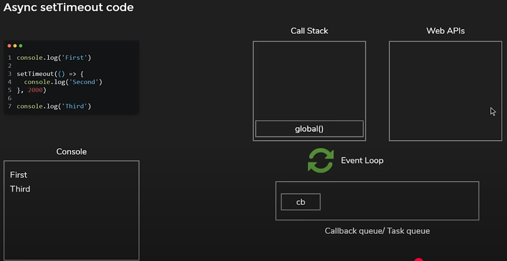

# General Notes on Javascript

**JavaScript (or ECMAScript)** is a programming language that helps you add interactivity to your web pages.

Using JavaScript, you can **add or remove content from a web page without reloading** it.

## Link to JavaScript

The `script` tag with `defer` is placed in the `head` section. The `defer` attribute ensures the script is executed after the HTML is fully parsed.

```html
...
<script src="app.js" defer></script>
</head>
```

### Add fault tolerance

The `noscript` tag remains in the `body` section, as it provides a fallback message for users without JavaScript. Only one `noscript` tag is needed.

>If you are not using the `defer` attribute, the `script` tag should be placed just before the closing `body` tag.

```html
...
<noscript>
You need to enable JavaScript to view the full site.
</noscript>
<script src="app.js"></script>
</body>
</html>
```

## Set strict mode

JavaScript was designed to be easy to learn and allows the developer to make certain mistakes. For example, JavaScript **doesn't throw an error** when you use a **misspelled variable**, and instead **creates a new global one**. When you start learning JavaScript, having fewer **errors** is convenient. However, it can lead to writing code that is harder for browsers to **optimize** and harder for you to **debug**.

Switch to `strict` mode to get more useful errors when you make mistakes.

```js
'use strict';
```

## DOM Traversal

The YouTube video "Learn JavaScript DOM Traversal In 15 Minutes" by Web Dev Simplified explains **nine techniques for selecting and traversing elements within the Document Object Model (DOM) using JavaScript**. The video uses a simple HTML structure with a grandparent (red square), two parents (green rectangles), and children (blue rectangles) to illustrate these techniques. The video also links a blank `script.js` file to demonstrate the JavaScript code.

Here is a detailed description of the video with the corresponding code:

**1. Selecting Elements by ID using `document.getElementById()`**

- The video starts by emphasizing the importance of selecting elements in the DOM.
- To demonstrate selecting by ID, an ID of `grandparent-id` is added to the grandparent element in the HTML.
- The following JavaScript code is then used in `script.js` to select the grandparent element by its ID and change its background color:

     ```javascript
     const grandparent = document.getElementById('grandparent-id');
     grandparent.style.backgroundColor = 'lightgray';
     ```

- A helper function `changeColor` is introduced to simplify changing the background color of elements:

     ```javascript
     function changeColor(element) {
       element.style.backgroundColor = 'lightgray';
     }
     ```

- The code is then updated to use this function:

     ```javascript
     changeColor(grandparent);
     ```

**2. Selecting Elements by Class Name using `document.getElementsByClassName()`**

- The video explains how to select multiple elements that share a common class name. The parent elements in the HTML have the class `parent`.
- The following code attempts to select all parent elements and change their color:

     ```javascript
     const parents = document.getElementsByClassName('parent');
     // parents.forEach(changeColor); // This would result in an error
     ```

- The video points out that `getElementsByClassName()` returns an **HTMLCollection**, which does not have a `forEach` method directly.
- The HTMLCollection needs to be converted to an array to use `forEach`:

     ```javascript
     const parents = Array.from(document.getElementsByClassName('parent'));
     parents.forEach(changeColor);
     ```

- It's highlighted that only one element can have a specific ID, while multiple elements can share the same class name.

**3. Selecting Elements using `document.querySelector()`**

- The video introduces `document.querySelector()`, which allows selecting the **first element** that matches a specified CSS selector.
- It demonstrates replacing `getElementById()` with `querySelector()` to select the grandparent by its ID using the CSS selector `#grandparent-id`:

     ```javascript
     const grandparent = document.querySelector('#grandparent-id');
     changeColor(grandparent);
     ```

- It also shows how to select the grandparent using its class name with the CSS selector `.grandparent`, noting that even if multiple elements had this class, only the first one would be selected:

     ```javascript
     const grandparent = document.querySelector('.grandparent');
     changeColor(grandparent);
     ```

- An example of selecting the first parent element using its class is provided:

     ```javascript
     const parent = document.querySelector('.parent');
     changeColor(parent);
     ```

**4. Selecting Elements using `document.querySelectorAll()`**

- To select **all elements** that match a CSS selector, the video introduces `document.querySelectorAll()`.
- It demonstrates selecting all parent elements and changing their color:

     ```javascript
     const parents = document.querySelectorAll('.parent');
     parents.forEach(changeColor);
     ```

- The video states that `querySelector` and `querySelectorAll` are the preferred methods for selecting elements due to their consistency and the use of familiar CSS selectors. The speaker mentions using them almost exclusively.

**5. Traversing Down the DOM: Getting Children using the `children` property**

- The video explains how to access the direct children of an element using the `children` property, which returns an **HTMLCollection**.
- The following code shows how to get all the children of the grandparent (which are the parent elements) and change their color:

     ```javascript
     const parents = Array.from(grandparent.children);
     parents.forEach(changeColor);
     ```

- It also demonstrates how to access a specific child by index and then get its children:

     ```javascript
     const parentOne = parents;
     const children = Array.from(parentOne.children);
     changeColor(children); // Changes the color of the first child of the first parent
     ```

**6. Traversing Down the DOM: Using `querySelector()` and `querySelectorAll()` on any element**

- The video emphasizes that `querySelector`, `querySelectorAll`, `getElementById`, and `getElementsByClassName` can be used on **any element** in the DOM, not just the `document`.
- This allows for more targeted selection within specific parts of the DOM tree.
- An example shows how to directly select the first child of the grandparent using `querySelector()`:

     ```javascript
     const childOne = grandparent.querySelector('.child');
     changeColor(childOne);
     ```

- Another example demonstrates selecting all children of the grandparent using `querySelectorAll()`:

     ```javascript
     const children = grandparent.querySelectorAll('.child');
     children.forEach(changeColor);
     ```

**7. Traversing Up the DOM: Getting the Parent using the `parentElement` property**

- The video explains how to move up the DOM tree from a child element to its parent using the `parentElement` property.
- An ID of `child-1` is added to one of the child elements in the HTML.
- The following code selects this child and then navigates up to its parent and grandparent, changing their colors:

     ```javascript
     const childOne = document.querySelector('#child-1');
     changeColor(childOne); // Changes color of the child

     const parent = childOne.parentElement;
     changeColor(parent); // Changes color of the parent

     const grandparent = parent.parentElement;
     changeColor(grandparent); // Changes color of the grandparent
     ```

- The video briefly mentions `parentNode` but recommends using `parentElement` to ensure that an element is always selected.

**8. Traversing Up the DOM: Using the `closest()` method**

- The `closest()` method is introduced as a way to traverse upwards to the **nearest ancestor** (parent, grandparent, etc.) that matches a specified CSS selector.
- It starts from the element on which it's called and moves up the tree.
- The following code demonstrates how to go from `childOne` directly to the grandparent by using `closest()` with the `.grandparent` selector:

     ```javascript
     const grandparent = childOne.closest('.grandparent');
     changeColor(grandparent);
     ```

- The video highlights that `closest()` stops at the first matching ancestor it finds.

**9. Traversing Sideways in the DOM: Getting Siblings using `nextElementSibling` and `previousElementSibling`**

- The final part of the video covers how to navigate between sibling elements (elements at the same level in the DOM tree).
- The `nextElementSibling` property returns the next sibling element in the DOM.
- The `previousElementSibling` property returns the previous sibling element.
- The following code shows how to select `childOne` and then get its next sibling (`childTwo`) and change its color:

     ```javascript
     const childOne = document.querySelector('#child-1');
     const childTwo = childOne.nextElementSibling;
     changeColor(childTwo);
     ```

- It also demonstrates how to go back to the previous sibling using `previousElementSibling`:

     ```javascript
     const childOneAgain = childTwo.previousElementSibling;
     changeColor(childOneAgain);
     ```

- The speaker mentions that these sibling selectors are used less frequently compared to the other methods discussed.

The video concludes by reiterating the importance of these DOM traversal skills in JavaScript development and promotes the creator's full JavaScript course.

## JavaScript Can Change HTML Content

### Add interactivity - example: `button` for theme switch

- An example could be to create a `button` in the `HTML` file to switch between light and dark themes. Then, you attach the `button` to JavaScript code that performs the actual theme switching.

In your HTML file, add a `button` element. Put the `button` inside of a `div` element.

```html
...
<ul>
  <li class="list">Add visual styles</li>
  <li class="list">Add light and dark themes</li>
  <li>Enable switching the theme</li>
</ul>
<div>
  <button class="btn">Dark</button>
</div>
...
```

## Event Listeners and Handlers in Javascript

Here are detailed notes with accompanying code examples based on the YouTube video transcript "Event Handling in Javascript | Event Listeners and Handlers in Javascript | Web Development #47" by Coding Shuttle by Anuj Bhaiya:

### **Introduction to DOM Events**

- An **event** allows you to write JavaScript code that reacts to certain situations.
- Events enable dynamic behavior on websites, such as responding to user interactions (clicks, keyboard input) or browser actions (page loading).
- Examples of events include:
  - User clicking on a mouse button.
  - A web page loading.
  - A form element's value being changed.
  - Mouse hovering over an element.
  - Keyboard input.

### **Two Ways to Capture Events**

The video discusses two primary ways to handle events in JavaScript:

1. **By using Event Handlers (Inline HTML Attributes)**
2. **By using Event Listeners (`addEventListener` method)**

#### **1. Event Handlers (Inline HTML Attributes)**

- JavaScript provides various kinds of **event handlers** that get triggered based on specific actions on HTML elements.
- These are typically defined as **attributes directly within the HTML elements**.
- Common event handler attributes include:
  - `onclick`: Triggered when an element is clicked.
  - `onload`: Triggered when an element (often `<body>`) has finished loading.
  - `onmouseover`: Triggered when the mouse pointer moves over an element.
  - `onmouseout`: Triggered when the mouse pointer moves out of an element.
  - `onmousemove`: Triggered when the mouse pointer is moving while it is over an element.
  - `onkeydown`: Triggered when a key is pressed down.
  - `onkeypress`: Triggered when a key is pressed and released (repeatedly if held down for most keys, but doesn't include all keys like Shift, Alt, Ctrl, or arrow keys).
  - `onkeyup`: Triggered when a key is released.
  - `onfocus`: Triggered when an element gains focus (e.g., when an input field is clicked into).
  - `onblur`: Triggered when an element loses focus.
  - `onchange`: Triggered when the value of an input element changes.
  - And many more.

- **Example: `onclick` event handler**

    ```html
    <div id="box1">Box 1</div>
    <script>
      function myfunction() {
        console.log("I was clicked");
      }
    </script>
    ```

    ```html
    <div id="box1" onclick="myfunction()">Box 1</div>
    ```

    When "Box 1" is clicked, the `myfunction()` in the JavaScript will be executed, and "I was clicked" will be logged to the console.

- **Example: `onmouseover` event handler**

    ```html
    <div id="box2">Box 2</div>
    <script>
      function mouseOverHandler() {
        console.log("Mouse over");
      }
    </script>
    ```

    ```html
    <div id="box2" onmouseover="mouseOverHandler()">Box 2</div>
    ```

    When the mouse cursor moves over "Box 2", "Mouse over" will be logged to the console.

- **Example: `onmousemove` event handler**

    ```html
    <div id="box2">Box 2</div>
    <script>
      function mouseMoveHandler() {
        console.log("Mouse move");
      }
    </script>
    ```

    ```html
    <div id="box2" onmousemove="mouseMoveHandler()">Box 2</div>
    ```

    While the mouse cursor is moving within "Box 2", "Mouse move" will be logged repeatedly to the console.

- **Example: Keyboard event handlers (`onkeydown`, `onkeypress`, `onkeyup`)**

    ```html
    <form>
      <input type="text" id="nameInput">
    </form>
    <script>
      function keyDownHandler() {
        console.log("Key Down");
      }
      function keyPressHandler() {
        console.log("Key Pressed");
      }
      function keyUpHandler() {
        console.log("Key Up");
      }
      const nameInput = document.getElementById('nameInput');
      nameInput.onkeydown = keyDownHandler;
      nameInput.onkeypress = keyPressHandler;
      nameInput.onkeyup = keyUpHandler;
    </script>
    ```

  - `onkeydown` is triggered when a key is initially pressed down.
  - `onkeypress` is triggered while the key is pressed (between `keydown` and `keyup`).
  - `onkeyup` is triggered when the key is released.

**2. Event Listeners (`addEventListener` method)**

- Event listeners provide a more flexible and recommended way to handle events.
- With event listeners, you define the event handling logic entirely within your JavaScript code, keeping it separate from the HTML structure.
- To use an event listener, you first need to **select the HTML element** you want to attach the event to.
- Then, you use the `addEventListener()` method on that element.
- The `addEventListener()` method takes **two mandatory arguments** and an optional third argument:
    1. The **type of event** to listen for (a string, e.g., `'click'`, `'mouseover'`, `'keydown'`). **Note that you do not use the `on` prefix here**.
    2. The **callback function** to be executed when the event occurs. This can be a named function or an anonymous arrow function.
    3. An **optional boolean value** indicating whether to use capturing or bubbling for event propagation (default is `false` for bubbling).

- **Example: `click` event listener**

    ```html
    <div id="box1">Box 1</div>
    <script>
      const box1 = document.getElementById('box1');
      box1.addEventListener('click', () => {
        console.log("Click by Event Listener");
      });
    </script>
    ```

    When "Box 1" is clicked, the arrow function will be executed, and "Click by Event Listener" will be logged to the console.

- **Benefits of using Event Listeners:**
  - **Separation of Concerns:** JavaScript logic is kept separate from HTML structure.
  - **Multiple Event Listeners:** You can attach multiple event listeners for the same event type to the same element. If you try to define multiple `onclick` attributes in HTML, the last one will override the previous ones.

    ```javascript
    const box1 = document.getElementById('box1');
    box1.addEventListener('click', () => {
      console.log("Click by Event Listener 1");
    });
    box1.addEventListener('click', () => {
      console.log("Click by Event Listener 2");
    });
    ```

    In this case, both "Click by Event Listener 1" and "Click by Event Listener 2" will be logged to the console when "Box 1" is clicked.

- **The Event Object:**
  - The callback function in an event listener can receive an **event object** as an argument. This object contains information about the event that occurred.
  - You can name this parameter as you like (e.g., `event`, `e`).
  - The event object provides various properties and methods related to the event, such as:
    - `target`: The element that triggered the event.
    - `clientX`, `clientY`: The horizontal and vertical coordinates of the mouse pointer at the time of the event.
    - `key`: The value of the key pressed during a keyboard event.
    - And much more.

  - **Example: Accessing the event object for a `click` event**

      ```javascript
      const box1 = document.getElementById('box1');
      box1.addEventListener('click', (event) => {
        console.log("Event Object:", event);
        console.log("Click X:", event.clientX);
        console.log("Click Y:", event.clientY);
      });
      ```

  - **Example: Accessing mouse coordinates on `mousemove`**

      ```javascript
      const box1 = document.getElementById('box1');
      box1.addEventListener('mousemove', (event) => {
        console.log("Mouse X:", event.clientX, "Mouse Y:", event.clientY);
      });
      ```

  - **Example: Accessing the pressed key on `keypress`**

      ```html
      <form>
        <input type="text" id="nameInput">
      </form>
      <script>
        const nameInput = document.getElementById('nameInput');
        nameInput.addEventListener('keypress', (event) => {
          console.log("Key Pressed:", event.key);
        });
      </script>
      ```

  - **Difference between `keypress` and `keydown` for special keys:**
    - `keypress` is mainly for character keys (letters, numbers, symbols). It might not fire for special keys like Backspace or arrow keys.
    - `keydown` tracks the physical keys pressed, so it will fire for all keys, including Backspace, arrow keys, Shift, Alt, Ctrl, etc.

  - **Example: Using `keydown` to capture all key presses**

    ```javascript
    const nameInput = document.getElementById('nameInput');
    nameInput.addEventListener('keydown', (event) => {
      console.log("Key Down:", event.key);
    });
    ```

  - **Example: `focus` event listener**

      ```html
      <form>
        <input type="text" id="nameInput">
      </form>
      <script>
        const nameInput = document.getElementById('nameInput');
        nameInput.addEventListener('focus', (event) => {
          console.log("Input focused:", event);
        });
      </script>
      ```

      The `focus` event is triggered when the input field gains focus. The `key` property might not be directly relevant for the `focus` event itself.

### **Event Propagation: Bubbling and Capturing**

- When an event occurs on an HTML element, it goes through a process called **event propagation**, which determines the order in which event listeners are triggered.
- There are two phases of event propagation:
    1. **Bubbling (Default Behavior)**: The event first triggers the handler on the **innermost** element that generated the event, and then "bubbles up" to the handlers on its parent elements in the DOM tree, all the way up to the `document`.
    2. **Capturing**: The event first triggers the handlers on the **outermost** ancestor elements (starting from the `document`) and then propagates down to the target element.

- **Example of Event Bubbling:**

    ```html
    <div id="container">
      <div id="box1">Box 1</div>
    </div>
    <script>
      const container = document.getElementById('container');
      const box1 = document.getElementById('box1');

      box1.addEventListener('click', () => {
        console.log("Click on Box");
      });

      container.addEventListener('click', () => {
        console.log("Click on Container");
      });
    </script>
    ```

    When you click on "Box 1", you will first see "Click on Box" logged, and then "Click on Container". This is because the click event on `box1` bubbles up to its parent, `container`.

- **Enabling Event Capturing:**
  - You can enable the capturing phase by passing `true` as the **third optional argument** to the `addEventListener()` method.
  - The default value of this argument is `false`, which means bubbling is used.

- **Example of Event Capturing:**

    ```html
    <div id="container">
      <div id="box1">Box 1</div>
    </div>
    <script>
      const container = document.getElementById('container');
      const box1 = document.getElementById('box1');

      box1.addEventListener('click', () => {
        console.log("Click on Box");
      });

      container.addEventListener('click', () => {
        console.log("Click on Container (Capturing)");
      }, true);

      // or 

      /*container.addEventListener('click', () => {
        console.log("Click on Container (Capturing)");
      }, { capture: true });*/
    ```

    Now, when you click on "Box 1", you will first see "Click on Container (Capturing)" logged, and then "Click on Box". This is because the click event is first captured by the container's listener before reaching the target element (`box1`).

### Capturing vs. Bubbling Order

- The event flow has three phases: the **capturing phase**, the **target phase** (when the event reaches the target element), and the **bubbling phase**.
- First, capture listeners are triggered from the `document` down to the target's parent.
- Then, the event reaches the target element, and its listeners (both capture and bubble) are triggered.
- Finally, the event bubbles up from the target element to the `document`, triggering bubble listeners along the way.

- **Code demonstrating both capturing and bubbling listeners:**

    ```javascript
    document.addEventListener('click', () => {
      console.log('document capture');
    }, true);

    grandparent.addEventListener('click', () => {
      console.log('grandparent capture');
    }, true);

    parent.addEventListener('click', () => {
      console.log('parent capture');
    }, true);

    child.addEventListener('click', () => {
      console.log('child capture');
    }, true);

    child.addEventListener('click', () => {
      console.log('child bubble');
    });

    parent.addEventListener('click', () => {
      console.log('parent bubble');
    });

    grandparent.addEventListener('click', () => {
      console.log('grandparent bubble');
    });

    document.addEventListener('click', () => {
      console.log('document bubble');
    });
    ```

**`stopPropagation()` Method**

- The `stopPropagation()` method of the event object prevents the event from further propagating up or down the DOM tree (depending on the current phase).
- If `stopPropagation()` is called in a capture listener, the event will not trigger any further capture listeners or any listeners in the target or bubbling phases on descendant elements.
- If called in a bubble listener, it will prevent the event from bubbling up to parent elements.

- **Code demonstrating `stopPropagation()` in the parent capture phase:**

    ```javascript
    document.addEventListener('click', () => {
      console.log('document capture');
    }, true);

    grandparent.addEventListener('click', () => {
      console.log('grandparent capture');
    }, true);

    parent.addEventListener('click', (e) => {
      console.log('parent capture');
      e.stopPropagation();
    }, true);

    child.addEventListener('click', () => {
      console.log('child bubble');
    });

    parent.addEventListener('click', () => {
      console.log('parent bubble');
    });

    grandparent.addEventListener('click', () => {
      console.log('grandparent bubble');
    });
    ```

- **Code demonstrating `stopPropagation()` in the child bubble phase:**

    ```javascript
    child.addEventListener('click', (e) => {
      console.log('child bubble');
      e.stopPropagation();
    });

    parent.addEventListener('click', () => {
      console.log('parent bubble');
    });

    grandparent.addEventListener('click', () => {
      console.log('grandparent bubble');
    });
    ```

**`once` Option for Event Listeners**

- You can use the `once` option in the third argument of `addEventListener` to make an event listener run only **once**.
- After the event listener is triggered for the first time, it is automatically removed.

- **Code demonstrating the `once` option:**

    ```javascript
    parent.addEventListener('click', () => {
      console.log('parent');
    }, { once: true });

    child.addEventListener('click', () => {
      console.log('child');
    });

    grandparent.addEventListener('click', () => {
      console.log('grandparent');
    });
    ```

**`removeEventListener()` Method**

- The `removeEventListener()` method is used to **remove** an event listener from an element.
- It takes the same two arguments as `addEventListener`: the event type and the callback function that was originally attached.
- To successfully remove a listener, you need to pass the **exact same function reference** that was used when adding the listener. Anonymous functions defined inline cannot be easily removed.

- **Code demonstrating adding and removing an event listener using a named function:**

    ```javascript
    function printHi() {
      console.log('hi');
    }

    parent.addEventListener('click', printHi);

    setTimeout(() => {
      parent.removeEventListener('click', printHi);
    }, 2000);
    ```

- **Incorrect way to try and remove an inline anonymous function:**

    ```javascript
    parent.addEventListener('click', () => {
      console.log('hi');
    });

    setTimeout(() => {
      parent.removeEventListener('click', () => {
        console.log('hi');
      });
    }, 2000);
    ```

### **Event Delegation**

- Event delegation is a technique where you attach a **single event listener to a parent element** to handle events that occur on its descendant elements.
- This is particularly useful for dynamically added elements, as you don't need to attach event listeners to each new element.
- You can use the `event.target` property within the parent's event listener to determine which descendant element triggered the event.
- The `Element.matches()` method can be used to check if the `event.target` matches a specific CSS selector.

- **Initial attempt to add listeners to all divs (will not work for dynamically added divs):**

    ```javascript
    const divs = document.querySelectorAll('div');
    divs.forEach(div => {
      div.addEventListener('click', () => {
        console.log('hi');
      });
    });

    const newDiv = document.createElement('div');
    newDiv.style.width = '200px';
    newDiv.style.height = '200px';
    newDiv.style.backgroundColor = 'purple';
    document.body.append(newDiv);
    ```

- **Manually adding an event listener to a dynamically created div:**

    ```javascript
    const newDiv = document.createElement('div');
    newDiv.style.width = '200px';
    newDiv.style.height = '200px';
    newDiv.style.backgroundColor = 'purple';
    document.body.append(newDiv);

    newDiv.addEventListener('click', () => {
      console.log('hi');
    });
    ```

- **Event delegation approach using `document.addEventListener` and `event.target.matches()`:**

    ```javascript
    document.addEventListener('click', (e) => {
      if (e.target.matches('div')) {
        console.log('hi');
      }
    });
    ```

**Creating a reusable `addGlobalEventListener` function**

- The video suggests creating a utility function for event delegation.

- **Reusable `addGlobalEventListener` function:**

    ```javascript
    function addGlobalEventListener(type, selector, callback) {
      document.addEventListener(type, e => {
        if (e.target.matches(selector)) {
          callback(e);
        }
      });
    }

    addGlobalEventListener('click', 'div', (e) => {
      console.log('hi');
    });
    ```

## JavaScript Output

### JavaScript Display Possibilities

JavaScript can "display" data in different ways:

- Writing into an HTML element, using `innerHTML` or `innerText`.
- Writing into the HTML output using `document.write()`.
- Writing into an alert box, using `window.alert()`.
- Writing into the browser console, using `console.log()`.

- - -

### Using innerHTML

To access an HTML element, you can use the `document.getElementById(id)` method.

Use the `id` attribute to identify the HTML element.

Then use the `innerHTML` property to change the HTML content of the HTML element:

#### Example 1

```html
<!DOCTYPE html>  
<html>  
<body>  
  
<h1>My First Web Page</h1>  
<p>My First Paragraph</p>  
  
<p id\="demo"></p>  
  
<script>  
document.getElementById("demo").innerHTML = "<h2>Hello World</h2>";  
</script>  
  
</body>  
</html>
```

> Note: Changing the innerHTML property of an HTML element is the most common way to display data in HTML.

- - -

### Using innerText

To access an HTML element, use the `document.getElementById(id)` method.

Then use the `innerText` property to change the inner text of the HTML element:

#### Example 2

```html
<!DOCTYPE html>  
<html>  
<body>  
  
<h1>My First Web Page</h1>  
<p>My First Paragraph</p>  
  
<p id\="demo"></p>  
  
<script>  
document.getElementById("demo").innerText = "Hello World";  
</script>  
  
</body>  
</html>
```

>Note: Use innerHTML when you want to change an HTML element.
>Use innerText when you only want to change the plain text.

- - -

### Using document.write()

For testing purposes, it is convenient to use `document.write()`:

#### Example 3

```html
<!DOCTYPE html>  
<html>  
<body>  
  
<h1>My First Web Page</h1>  
<p>My first paragraph.</p>  
  
<script>  
document.write(5 + 6);  
</script>  
  
</body>  
</html>
```

Using document.write() after an HTML document is loaded, will **delete all existing HTML**:

#### Example 4

```html
<!DOCTYPE html>  
<html>  
<body>  
  
<h1>My First Web Page</h1>  
<p>My first paragraph.</p>  
  
<button type\="button" onclick\="document.write(5 + 6)">Try it</button>  
  
</body>  
</html>
```

The document.write() method should only be used for testing.

- - -

### Using window.alert()

You can use an alert box to display data:

#### Example 5

```html
<!DOCTYPE html>  
<html>  
<body>  
  
<h1>My First Web Page</h1>  
<p>My first paragraph.</p>  
  
<script>  
window.alert(5 + 6);  
</script>  
  
</body>  
</html>
```

You can skip the `window` keyword.

In JavaScript, the `window` object is the global scope object. This means that variables, properties, and methods by default belong to the `window` object. This also means that specifying the `window` keyword is optional:

#### Example 6

```html
<!DOCTYPE html>  
<html>  
<body>  
  
<h1>My First Web Page</h1>  
<p>My first paragraph.</p>  
  
<script>  
alert(5 + 6);  
</script>  
  
</body>  
</html>
```

- - -

### JavaScript Print

JavaScript does not have any print object or print methods.

You cannot access output devices from JavaScript.

The only exception is that you can call the `window.print()` method in the browser to print the content of the current window.

#### Example 7

```html
<!DOCTYPE html>  
<html>  
<body>  
  
<button onclick\="window.print()">Print this page</button>  
  
</body>  
</html>
```

## DOM Manipulation

- The setup involves a blank HTML file linked to a JavaScript file.
- The JavaScript code will run and its effects will be visible on the blank page in the browser.

### Adding Elements to the Page

- **Selecting the element to append to**:
  - Example: `const body = document.body;` (selects the `body` element)

- **`append()` method**:
  - Used to add elements to a parent.
  - **Can append strings directly**:

      ```javascript
      body.append("hello world");
      ```

      Output: "hello world" will appear in the body.
  - **Can append multiple items at once** (strings and/or elements):

      ```javascript
      body.append("hello world", "to buy");
      ```

      Output: "hello worldto buy" will appear in the body.

- **`appendChild()` method**:
  - Similar to `append()` but with key differences.
  - **Cannot append strings directly**:

      ```javascript
      // This will cause an error:
      // body.appendChild("hello world");
      ```

      Error message: "appendChild requires a node and not a string".
  - **Can only append elements (nodes)**.
  - **Can only append one element at a time**.

      ```javascript
      // This is valid for appending an element:
      // const div = document.createElement('div');
      // body.appendChild(div);
      ```

- **Creating new elements**:
  - Use `document.createElement()` method, passing the tag name as a string.

      ```javascript
      const div = document.createElement('div');
      ```

      This creates a `div` element in memory but does not yet add it to the DOM.

- **Adding the created element to the page**:
  - Use `append()` or `appendChild()` on the parent element.

      ```javascript
      body.append(div); // Using append
      // body.appendChild(div); // Using appendChild
      ```

      This adds the `div` element as the last child of the `body`. Initially, it will be empty and not visible unless content is added.

### Modifying Text Content

- **`innerText` property**:
  - Used to set or get the textual content of an element.
  - Setting text:

      ```javascript
      div.innerText = "hello world";
      ```

      This sets the text inside the `div` to "hello world".
  - When getting text, it **only returns the text that is visible** on the page, taking CSS visibility into account.

- **`textContent` property**:
  - Used to set or get the textual content of an element.
  - Setting text:

      ```javascript
      div.textContent = "hello world 2";
      ```

      This sets the text inside the `div` to "hello world 2".
  - When getting text, it **returns the entire text content of the element**, including text from elements that are hidden with CSS (e.g., `display: none`), as well as all the spacing and indentation from the HTML.

- **Difference between `innerText` and `textContent`**:
  - Example HTML structure:

      ```html
      <div>
        <span>hello</span>
        <span style="display: none;">buy</span>
      </div>
      ```

  - Selecting the `div`:

      ```javascript
      const divElement = document.querySelector('div');
      ```

  - `console.log(divElement.textContent);` will output:

      ```bash
        hello
        buy
      ```

      (including spacing and the text from the hidden span).
  - `console.log(divElement.innerText);` will output:

      ```bash
      hello
      ```

      (only the visible text).

### Modifying HTML Content

- **`innerHTML` property**:
  - Used to set or get the HTML content of an element as a string.
  - Setting HTML:

      ```javascript
      div.innerHTML = "<strong>hello world 2</strong>";
      ```

      This will render "hello world 2" in bold inside the `div`. The HTML tags are interpreted and rendered.
  - **Security concern**: Using `innerHTML` with user-generated content can lead to security vulnerabilities (e.g., cross-site scripting - XSS) because malicious scripts can be injected.

- **Safer alternative to `innerHTML` for dynamic content**:
  - Create elements using `document.createElement()` and set their `innerText` before appending.

      ```javascript
      const strong = document.createElement('strong');
      strong.innerText = "hello world 2";
      div.append(strong);
      ```

      This achieves the same visual result (bold text) without the security risks of directly injecting HTML strings.

- `append()` can be used on any element to add children to it.

### Removing Elements from the DOM

- **`remove()` method**:
  - Called on the element itself to remove it from the DOM entirely.

      ```javascript
      const spanBye = document.querySelector('#bye');
      spanBye.remove();
      ```

      This will remove the element with the ID "bye" from the page. The element is deleted from the HTML structure. The element can still be referenced in JavaScript and potentially added back later.

- **`removeChild()` method**:
  - Called on the parent element, and you need to pass the child element you want to remove as an argument.

      ```javascript
      const divElement = document.querySelector('div');
      const spanHi = document.querySelector('#hi');
      divElement.removeChild(spanHi);
      ```

      This will remove the `spanHi` element (which is a child of `divElement`) from the DOM.

- The video author generally prefers using `remove()` as it is considered simpler when you have direct access to the element you want to remove.

### Modifying Element Attributes

- **`getAttribute()` method**:
  - Used to get the value of an attribute of an element, passing the attribute name as a string.

      ```javascript
      const spanHi = document.querySelector('#hi');
      console.log(spanHi.getAttribute('id')); // Output: "hi"
      console.log(spanHi.getAttribute('title')); // Output: "hello" (if the title attribute exists)
      ```

- **Accessing attributes directly as properties**:
  - Many standard HTML attributes are also available as properties directly on the DOM element object.

      ```javascript
      console.log(spanHi.id); // Output: "hi"
      console.log(spanHi.title); // Output: "hello" (if the title attribute exists)
      ```
  
  - Generally, if an attribute can be accessed with `getAttribute()`, it's also available as a direct property. `getAttribute()` can be useful for attributes that don't have a direct property.

- **`setAttribute()` method**:
  - Used to set or change the value of an attribute on an element, taking the attribute name and the new value as arguments.

      ```javascript
      spanHi.setAttribute('id', 'new-id');
      spanHi.setAttribute('title', 'new title');
      ```

- **Setting attributes directly as properties**:
  - Attributes can also be set directly as properties on the DOM element object.

      ```javascript
      spanHi.id = 'another-new-id';
      spanHi.title = 'another new title';
      ```

- **`removeAttribute()` method**:
  - Used to remove an attribute from an element, passing the attribute name as a string.

      ```javascript
      spanHi.removeAttribute('title');
      spanHi.removeAttribute('id');
      ```

### Working with Data Attributes

- Data attributes are custom attributes that start with `data-` followed by the attribute name (e.g., `data-test`, `data-longer-name`).

- **Accessing data attributes using the `dataset` property**:
  - The `dataset` property of a DOM element provides access to all its data attributes as properties of an object.
  - Data attribute names are converted to camelCase when accessed via `dataset`.

      ```html
      <span id="hi" data-test="this is a test" data-longer-name="random text">Hello</span>
      ```

      ```javascript
      const spanHi = document.querySelector('#hi');
      console.log(spanHi.dataset); // Output: DOMStringMap { test: "this is a test", longerName: "random text" }
      console.log(spanHi.dataset.test); // Output: "this is a test"
      console.log(spanHi.dataset.longerName); // Output: "random text"
      ```

- **Setting data attributes using the `dataset` property**:
  - Properties can be added or modified on the `dataset` object, and they will be reflected as `data-` attributes in the HTML (with camelCase names converted to hyphenated).

      ```javascript
      spanHi.dataset.newName = 'hi';
      // The HTML will now have: <span id="hi" data-test="this is a test" data-longer-name="random text" data-new-name="hi">Hello</span>
      ```

### Manipulating Classes

- **`classList` property**:
  - Provides a read-only DOMTokenList representing the class attribute of an element.
  - Offers methods to add, remove, toggle, and check for classes.

      ```html
      <span id="hi" class="hi1 hi2">Hello</span>
      ```

      ```javascript
      const spanHi = document.querySelector('#hi');
      console.log(spanHi.classList);
      // Output: DOMTokenList ["hi1", "hi2"]
      ```

- **`classList.add()`**:
  - Adds one or more class names to the element's class list.

      ```javascript
      spanHi.classList.add('new-class');
      // Class attribute becomes: "hi1 hi2 new-class"
      ```

- **`classList.remove()`**:
  - Removes one or more class names from the element's class list.

      ```javascript
      spanHi.classList.remove('hi1');
      // Class attribute becomes: "hi2 new-class"
      ```

- **`classList.toggle()`**:
  - Toggles a class name; if the class exists, it's removed, and if it doesn't, it's added.

      ```javascript
      spanHi.classList.toggle('hi2'); // Removes 'hi2' if it exists, adds it if it doesn't
      spanHi.classList.toggle('hi3'); // Adds 'hi3' if it doesn't exist
      ```
  
  - Can also take a boolean argument to force the class to be added (if `true`) or removed (if `false`).

      ```javascript
      spanHi.classList.toggle('another-class', true); // Ensures 'another-class' is added
      spanHi.classList.toggle('yet-another', false); // Ensures 'yet-another' is removed
      ```

### Modifying Inline Styles

- The `style` property of a DOM element is an object representing the element's inline styles.
- CSS properties can be accessed and set as properties of this `style` object.
- **CSS property names are converted to camelCase** in JavaScript (e.g., `background-color` becomes `backgroundColor`).
  
  ```javascript
  const spanHi = document.querySelector('#hi');
  spanHi.style.color = 'red'; // Sets the text color to red
  spanHi.style.backgroundColor = 'red'; // Sets the background color to red
  ```

## 🌟 Top DOM Collection Types (Most Used ➡️ Less Used)

- - -

### **1. `NodeList`**

- **Returned by:** `document.querySelectorAll()`
- **Iterable?** ✅ Yes (`forEach`, `for...of`)
- **Live?** ❌ No (static snapshot)

#### 💡 Use Case1

When you want to select **all matching elements by CSS selectors** and loop over them easily:

```js
const buttons = document.querySelectorAll('.btn');
buttons.forEach(btn => btn.addEventListener('click', handleClick));
```

- - -

### **2. `HTMLCollection`**

- **Returned by:** `getElementsByClassName()`, `getElementsByTagName()`, `element.children`
- **Iterable?** ❌ No `forEach` (needs conversion)
- **Live?** ✅ Yes

#### 💡 Use Case2

Used when you want a **live collection** that updates automatically when the DOM changes:

```js
const items = document.getElementsByClassName('item'); // live
// Convert if you want .forEach:
Array.from(items).forEach(item => console.log(item));
```

- - -

### **3. `DOMTokenList`**

- **Returned by:** `element.classList`
- **Iterable?** ✅ Yes (`forEach`, `for...of`)
- **Live?** ✅ Yes (represents real-time class list)

#### 💡 Use Case3

Used to manage class names easily:

```js
element.classList.add('active');
element.classList.toggle('dark-mode');
element.classList.contains('open');
```

- - -

### **4. `NamedNodeMap`**

- **Returned by:** `element.attributes`
- **Iterable?** ❌ No modern methods
- **Live?** ✅ Yes

#### 💡 Use Case4

Used to access all attributes of an element, rarely needed unless working with dynamic attribute manipulation:

```js
const attrs = document.getElementById('myDiv').attributes;
console.log(attrs[0].name, attrs[0].value);
```

- - -

### **5. `StyleSheetList`**

- **Returned by:** `document.styleSheets`
- **Iterable?** ❌ No direct `.forEach` (use conversion)
- **Live?** ✅ Yes

#### 💡 Use Case5

Used when dynamically inspecting or modifying CSS stylesheets:

```js
for (let sheet of document.styleSheets) {
  console.log(sheet.href); // External stylesheet links
}
```

- - -

### **6. `CSSRuleList`**

- **Returned by:** `stylesheet.cssRules`
- **Iterable?** ❌ No `.forEach`
- **Live?** ✅ Yes

#### 💡 Use Case6

Used in more advanced dynamic style manipulations:

```js
const rules = document.styleSheets[0].cssRules;
console.log(rules[0].selectorText);
```

- - -

### 📌 Summary Table 2

| Collection Type   | `forEach`? | Live? | Common Use                      |
|-------------------|------------|-------|---------------------------------|
| `NodeList`        | ✅         | ❌    | Element groups (querySelectorAll) |
| `HTMLCollection`  | ❌         | ✅    | Class/tag-based groups          |
| `DOMTokenList`    | ✅         | ✅    | Manipulate classList            |
| `NamedNodeMap`    | ❌         | ✅    | Inspect attributes              |
| `StyleSheetList`  | ❌         | ✅    | Access all stylesheets          |
| `CSSRuleList`     | ❌         | ✅    | Access CSS rules in stylesheets |

- - -

## String & Array Methods

Here are **some of the most commonly chained methods**, grouped by **data type**:

### 🔤 **String methods**

| Method | Description |
|--------|-------------|
| `.toLowerCase()` | Converts to lowercase |
| `.toUpperCase()` | Converts to uppercase |
| `.trim()` | Removes whitespace from both ends |
| `.replace()` | Replaces part of the string |
| `.split()` | Splits string into array |
| `.slice()` | Extracts part of a string |

**Example:**

```javascript
"  Hello World  ".trim().toUpperCase().split(" ");
// → ["HELLO", "WORLD"]
```

### 🧮 **Array methods**

These are often chained for transformations.

| Method | Description |
|--------|-------------|
| `.map()` | Transforms each element |
| `.filter()` | Filters elements by condition |
| `.reduce()` | Reduces array to a single value |
| `.sort()` | Sorts elements |
| `.reverse()` | Reverses the array |
| `.forEach()` | Executes a function for each element |
| `.join()` | Joins elements into a string |
| `.slice()` | Extracts a portion of the array |

**Example:**

```javascript
[1, 2, 3, 4, 5]
  .filter(n => n % 2 === 0)     // [2, 4]
  .map(n => n * 10)             // [20, 40]
  .join(", ");                  // "20, 40"
```

### 🧵 **Useful combos**

#### String to array and back

```javascript
"one-two-three".split("-").map(w => w.toUpperCase()).join(" ");
// "ONE TWO THREE"
```

#### Array clean-up

```javascript
["  hello", "world ", " js  "]
  .map(s => s.trim().toUpperCase());
// ["HELLO", "WORLD", "JS"]
```

### 🔄 Pro tip: Chain safely

If you're unsure if a value exists, use **optional chaining**:

```javascript
user?.name?.toUpperCase()
```

## Javascript Loops

In JavaScript, `for...in` and `for...of` are both used to iterate over things, but they serve different purposes and should be used in different contexts. Here's a breakdown:

### 🔁 `for...in` loop

- **What it does**: Iterates over the **enumerable properties (keys)** of an object.
- **Use it for**: Objects (when you need the keys).
- **Returns**: Property names (strings).

#### Example for...in

```javascript
const user = { name: "Alice", age: 30 };

for (let key in user) {
  console.log(key);        // name, age
  console.log(user[key]);  // Alice, 30
}
```

#### ⚠️ Caution

- Avoid using `for...in` on arrays unless you specifically want keys/indexes as strings.
- It also loops through **inherited properties**, which might not always be desirable.

### 🔁 `for...of` loop

- **What it does**: Iterates over the **values** of an iterable object (like arrays, strings, Maps, Sets).
- **Use it for**: Arrays, strings, Sets, Maps, NodeLists, etc.
- **Returns**: The values themselves.

#### Example for..of

```javascript
const numbers = [10, 20, 30];

for (let num of numbers) {
  console.log(num); // 10, 20, 30
}
```

#### Another example with string

```javascript
const word = "hello";

for (let char of word) {
  console.log(char); // h, e, l, l, o
}
```

### ✅ Summary: Which to use when?

| Use Case                          | Use `for...in`        | Use `for...of`       |
|----------------------------------|------------------------|-----------------------|
| Looping over object properties   | ✅ Yes                 | 🚫 No                |
| Looping over array values        | 🚫 Not recommended     | ✅ Yes               |
| Looping over string characters   | 🚫 No                  | ✅ Yes               |
| Working with Maps, Sets, etc.    | 🚫 No                  | ✅ Yes               |
| Need key/index (e.g., for objects)| ✅ Yes                 | 🚫 No                |

If you're working on arrays or anything iterable: **use `for...of`**.

If you're working on plain objects and need keys: **use `for...in`**.

## Callback Functions

Based on the source, **callback functions are functions that are passed as arguments to other functions**. They are not different from regular functions in terms of syntax; you can use regular function syntax, anonymous functions, or arrow functions. The key difference lies in how they are used. Instead of being called directly in the main part of your code, a callback function is expected to be executed at a later point by the function it was passed into.

Here are some examples of callback functions from the source:

- **Example 1 (Longer Form):**

    ```javascript
    function mainFunction(randomNumber, shouldCall, callback) {
      let result = randomNumber;
      if (shouldCall) {
        result = callback(randomNumber); // Executing the callback function
      }
      return result;
    }

    function myCallback(num) {
      return num * 2;
    }

    let output = mainFunction(20, true, myCallback); // Passing 'myCallback' as an argument
    ```

    In this example, `myCallback` is the callback function passed to `mainFunction`. `mainFunction` then executes `myCallback` if `shouldCall` is true.

- **Example 2 (Simplified Anonymous Function):**

    ```javascript
    function mainFunction(randomNumber, shouldCall, callback) {
      let result = randomNumber;
      if (shouldCall) {
        result = callback(randomNumber);
      }
      return result;
    }

    let output = mainFunction(20, true, function(num) { return num * 2; }); // Passing an anonymous function
    ```

    Here, an anonymous function is directly passed as the callback.

- **Example 3 (Arrow Function):**

    ```javascript
    function mainFunction(randomNumber, shouldCall, callback) {
      let result = randomNumber;
      if (shouldCall) {
        result = callback(randomNumber);
      }
      return result;
    }

    let output = mainFunction(20, true, (num) => { return num * 2; }); // Passing an arrow function
    ```

    This demonstrates passing an arrow function as a callback.

- **Example 4 (Simplified Arrow Function):**

    ```javascript
    function mainFunction(randomNumber, shouldCall, callback) {
      let result = randomNumber;
      if (shouldCall) {
        result = callback(randomNumber);
      }
      return result;
    }

    let output = mainFunction(20, true, num => num * 2); // Even simpler arrow function
    ```

    This is a more concise way of writing the arrow function callback when it has a single parameter and a single return statement.

**Why are callback functions used?**

According to the source, callback functions enable two main things:

- **Reusability:** Callback functions allow you to reuse the same function for a variety of use cases by passing in different callback functions that define specific logic or transformations. The `map` array method is a prime example of this. The `map` method iterates over an array, and you provide a callback function that specifies how each element in the array should be transformed. This allows the `map` method to be used for doubling numbers, extracting the first letter of strings, or any other transformation you can define in the callback.

    For instance, using the `map` method with different callbacks:

    

    As seen with the `map` function, the built-in functions in JavaScript often use callbacks heavily, allowing for flexible and reusable code. Other array methods like `filter`, `findIndex`, and `forEach` also utilize callback functions to achieve different functionalities based on the provided logic.

- **Asynchronous Programming:** Callbacks are also used to handle code that does not run immediately, which is known as asynchronous programming. In situations where an operation might take some time (e.g., fetching data from a server or a database), you can provide a callback function that will be executed once the asynchronous operation is complete. This prevents the program from freezing or waiting idly for the operation to finish and allows other code to run in the meantime. The source mentions that asynchronous callbacks, promises, and async/await are different ways to handle asynchronous JavaScript code, and these will be discussed later in the series.

## Some Array Methods

`forEach`, `map`, `filter`, `reduce`, and `findIndex` are **array methods** in JavaScript. They are used to **iterate**, **transform**, or **analyze** arrays.

### 1️⃣ `forEach()`

**Purpose:** Executes a function once per array element (used for side effects, not for returning values).

```js
array.forEach((element, index, array) => {
  // code
});
```

- `element` ✅ – Current item (required)
- `index` ❌ – Index of item (optional)
- `array` ❌ – The full array (optional)

**Returns:** `undefined` (doesn’t return a new array)

**Example:**

```js
[1, 2, 3].forEach((num, idx) => console.log(idx, num));
```

### 2️⃣ `map()`

**Purpose:** Transforms each element and returns a **new array**.

```js
const newArray = array.map((element, index, array) => {
  return newValue;
});
```

- Same params as `forEach`
- **Must return a value** from the function

**Example:**

```js
const doubled = [1, 2, 3].map(n => n * 2); // [2, 4, 6]
```

### 3️⃣ `filter()`

**Purpose:** Returns a new array with elements that **pass the test (return true)**.

```js
const filtered = array.filter((element, index, array) => {
  return condition;
});
```

**Example:**

```js
const evens = [1, 2, 3, 4].filter(n => n % 2 === 0); // [2, 4]
```

### 4️⃣ `reduce()`

**Purpose:** Reduces array to a single value (e.g. sum, product, object, etc.).

```js
const result = array.reduce((accumulator, currentValue, index, array) => {
  return updatedAccumulator;
}, initialValue);
```

- `accumulator` ✅ – Value carried across iterations
- `currentValue` ✅ – Current element
- `initialValue` ✅ – Starting value for the accumulator

**Example:**

```js
const sum = [1, 2, 3, 4].reduce((acc, val) => acc + val, 0); // 10
```

### 5️⃣ `findIndex()`

**Purpose:** Returns the **index** of the **first** element that satisfies the condition. Returns `-1` if none found.

```js
const index = array.findIndex((element, index, array) => {
  return condition;
});
```

**Example:**

```js
const idx = [5, 12, 8, 130].findIndex(num => num > 10); // 1 (index of 12)
```

### 📌 Summary Table 1

| Method      | Returns       | Use case                   |
|-------------|---------------|----------------------------|
| `forEach`   | `undefined`   | Side effects, logging      |
| `map`       | `new array`   | Transform values           |
| `filter`    | `new array`   | Keep some elements         |
| `reduce`    | Any value     | Accumulate into 1 value    |
| `findIndex` | Number        | Find index of first match  |

## Asynchronous JavaScript

### Introduction to Asynchronous JavaScript

- This crash course will cover topics related to asynchronous JavaScript.
- Understanding asynchronous concepts is crucial for every JavaScript developer.
- We will cover timeouts and intervals, callbacks, promises, async/await, and the event loop.
- For junior developers, a surface knowledge of these topics might suffice, but senior roles require a deeper understanding.
- We will first understand the "what" and "why" of async JavaScript, then the "how" with exercises, and finally how everything behaves with the event loop.

### The Basics of JavaScript: Synchronous, Blocking, Single-Threaded

- In its most basic form, **JavaScript is a synchronous, blocking, single-threaded language**.
  - **Synchronous:** Code executes top-down, with only one line executing at any given time. If there are two functions, `functionA` and `functionB`, and both are called, JavaScript will always execute `functionA` completely before starting `functionB`.

    ```javascript
    function functionA() {
      console.log('A');
    }

    function functionB() {
      console.log('B');
    }

    functionA();
    functionB(); // Output: A, then B
    ```

  - **Blocking:** Due to its synchronous nature, if a process takes a long time, subsequent processes are blocked until the current one completes. If `functionA` has an intensive task, JavaScript must finish it before moving to `functionB`, even if it takes a significant amount of time. This can cause the browser to appear frozen if a web app executes intensive code without returning control.
  - **Single-Threaded:** A thread is a process that a JavaScript program uses to run a task. JavaScript has only one thread, the **main thread**, for executing code. Unlike languages with multi-threading, JavaScript cannot run multiple tasks in parallel.

### The Problem with Synchronous JavaScript

- This synchronous, blocking model creates a problem when dealing with tasks like retrieving data from a database.
- We need to wait for the data to be fetched before we can run code on it. This waiting period (which could be one second or more) would block all other JavaScript code execution.
- If JavaScript didn't wait, it would proceed with execution before the data was available, leading to errors.
- Therefore, we need a way to have **asynchronous behavior** in JavaScript.

### How Asynchronous Programming is Catered to in JavaScript

- **Just JavaScript alone is not enough for asynchronous programming**.
- We need additional pieces outside of JavaScript, specifically provided by **web browsers** (and Node.js).
- Browsers define functions and APIs that allow us to register functions that should not be executed synchronously.
- Instead, these functions are invoked **asynchronously** when a certain event occurs, such as the passage of time, user interaction (mouse clicks), or the arrival of data over the network.
- This means your code can do several things at the same time without stopping or blocking the main thread.

### Traditional Methods for Asynchronous JavaScript: Timeouts and Intervals

- JavaScript has traditional methods for running code asynchronously: **timeouts and intervals**.
- These allow you to execute code after a set time period has elapsed or at regular intervals.
- The specific functions are `setTimeout` and `setInterval`.

#### `setTimeout`

- The `setTimeout` function executes a particular block of code **once** after a specified time has elapsed.
- **Parameters:**
  - The first parameter is a **function to run** or a reference to a function defined elsewhere.
  - The second parameter is a **number representing the duration in milliseconds** to wait before executing the code.
  - After the second parameter, you can pass in **zero or more values** that represent any parameters you want to pass to the function when it is run.

- **Example:**

    ```javascript
    function greet() {
      console.log('hello');
    }

    setTimeout(greet, 2000); // Logs "hello" after 2 seconds
    ```

- **Passing Parameters:**

    ```javascript
    function greet(name) {
      console.log('hello ' + name);
    }

    setTimeout(greet, 2000, 'vishwas'); // Logs "hello vishwas" after 2 seconds
    ```

- **Clearing a Timeout:**
  - You can cancel a `setTimeout` using the `clearTimeout` method.
  - `clearTimeout` takes the **identifier returned by `setTimeout`** as a parameter.

    ```javascript
    function greet() {
      console.log('hello');
    }

    const timeoutId = setTimeout(greet, 2000);
    clearTimeout(timeoutId); // The greet function will not execute
    ```

  - Clearing timeouts is practical when a component is unmounting to free up resources and prevent code from incorrectly executing on an unmounted component.

#### `setInterval`

- The `setInterval` function allows you to **repeatedly run the same code** over and over again at regular intervals.
- **Signature:** The signature is the same as `setTimeout`.
  - First parameter: the code to execute (function or reference).
  - Second parameter: the duration in milliseconds between executions.
  - Subsequent parameters: arguments to pass to the function.

- **Example:**

    ```javascript
    function greet() {
      console.log('hello');
    }

    setInterval(greet, 2000); // Logs "hello" every 2 seconds
    ```

- **Clearing an Interval:**
  - Intervals keep running forever, so you should clear them when appropriate using the `clearInterval` function.
  - Capture the return value from `setInterval` and pass it as an argument to `clearInterval`.

    ```javascript
    function greet() {
      console.log('hello');
    }

    const intervalId = setInterval(greet, 2000);
    // ... some condition to stop the interval ...
    clearInterval(intervalId);
    ```

### Key Points to Highlight About Timers and Intervals

- **Timers and intervals are not part of JavaScript itself.** They are implemented by the browser (and Node.js).
- `setTimeout` and `setInterval` are the JavaScript names given to this browser functionality.
- The **duration parameter** specified is the **minimum delay**, not a guaranteed delay.
  - For example, a `setTimeout` with 2000ms will execute the function at least after 2 seconds, but it could take longer if the call stack is busy.
  - Even a `setTimeout` with 0 milliseconds doesn't mean immediate execution. The function will run only when the call stack is free, after the minimum delay of 0ms. This will be explained further with the event loop.

- **Recursive `setTimeout` vs. `setInterval`:**
  - It's possible to achieve the same effect as `setInterval` with a recursive `setTimeout`.

    ```javascript
    // Using setInterval
    setInterval(function run() {
      console.log('hello');
    }, 100);

    // Using recursive setTimeout
    function run() {
      console.log('hello');
      setTimeout(run, 100);
    }
    run();
    ```

  - **Differences:**
    - **Guaranteed Delay:** Recursive `setTimeout` guarantees the specified delay between the *end* of one execution and the *start* of the next, regardless of how long the code takes to run. `setInterval`'s interval includes the execution time of the code. If the code takes longer than the interval, subsequent executions might overlap or not have the intended delay.
    - **Flexibility:** Recursive `setTimeout` allows for calculating a different delay before each iteration, offering more flexibility than the fixed interval of `setInterval`.
  - If your code within the interval can take longer to run than the interval itself, **recursive `setTimeout` is generally better** to maintain consistent time intervals.

## Callback Functions - Asynchronous programming

- **Definition**: A callback function is a function that is **passed as an argument to another function**.
- The function that accepts another function as an argument or returns a function is called a **higher-order function**.

### Why Use Callback Functions?

- Callbacks allow for **delayed execution** of a function until a particular time or event has occurred, which is crucial for asynchronous operations.
- Callbacks can be categorized into two types:
  - **Synchronous Callbacks**: A callback that is **executed immediately**.
    - Example:

        ```javascript
        function greet(name) {
          console.log('Hello ' + name);
        }

        function greetVishwas(callback) {
          const name = 'Vishwas';
          callback(name);
        }

        greetVishwas(greet); // Output: Hello Vishwas
        ```

    - In this example, `greet` is a synchronous callback function passed to `greetVishwas`, and it is executed immediately within `greetVishwas`.
    - Other practical examples include callback functions used with array methods like `sort`, `map`, or `filter`.
  - **Asynchronous Callbacks**: A callback that is often used to **continue or resume code execution after an asynchronous operation has completed**.
    - Used to delay the execution of a function until a particular time or event occurs.
    - Examples:
      - **`setTimeout`**:

        ```javascript
        function greetDelayed() {
          console.log('Hello after 2 seconds');
        }
        setTimeout(greetDelayed, 2000); // greetDelayed is an async callback
        console.log('This will be logged first');
        ```

      - Here, `greetDelayed` is the callback function, and it is executed asynchronously after a 2-second delay. `setTimeout` acts as the higher-order function.
      - **Event Handlers**:

          ```javascript
          const button = document.getElementById('myButton');
          button.addEventListener('click', function() {
            console.log('Button clicked!'); // This is an async callback
          });
          ```

      - The anonymous function passed to `addEventListener` is a callback that is executed asynchronously when the button is clicked.
      - **Data Fetching (Example with jQuery)**:

          ```javascript
          // (Conceptual example - jQuery not in sources but mentioned)
          $.get('url/to/data', function(data) {
            console.log('Data loaded:', data); // This is an async callback
          });
          ```

      - The function that handles the loaded data is a callback executed asynchronously after the data has been fetched.

### The Problem with Callbacks: Callback Hell

- When multiple asynchronous operations depend on each other, leading to nested callbacks, the code can become **difficult to read and maintain**. This is known as **callback hell**.
- Example of nested callbacks:

```javascript
asyncOperation1(function(result1) {
  asyncOperation2(result1, function(result2) {
    asyncOperation3(result2, function(result3) {
      // ... and so on
      console.log('Final result:', result3);
    });
  });
});
```

- The deep nesting makes the code less intuitive and harder to follow.

### Solution to Callback Hell: Promises

- **Promises**, introduced in ES6, provide an alternative and recommended approach to handle asynchronous code, making it more readable and manageable compared to nested callbacks.
- Promise chaining helps to avoid the deep nesting of callback hell.

## Promises in JavaScript

### Introduction to Promises

- In about eighty percent of the interviews, questions about promises are asked, especially for senior developer positions.
- A thorough understanding of promises is crucial.
- Promises can be understood through a simple analogy.

### Promise Analogy

- Scenario: You and your roommate want to have dinner at home. You'll make soup, and your roommate will get tacos from a food truck.
- You ask your roommate to text you when they reach the food truck so you can start setting the table, and also if they can't get tacos so you can make pasta instead.
- Your roommate promises to text.
- Analogy to JavaScript and Promises:
  - Your friend is like a **promise** in JavaScript.
  - Your friend going to the food truck and you preparing soup simultaneously is like an **asynchronous operation** in JavaScript (fetching tacos).
  - The status of the tacos is initially **pending** until you receive a message.
  - When your friend texts "can get tacos", your desire is **fulfilled**, and you set up the table (success callback).
  - When your friend texts "cannot get tacos", your desire is **rejected**, and you cook pasta (failure callback).

### MDN Definition of a Promise

- A promise is a **proxy for a value not necessarily known when the promise is created**.
- It allows you to **associate handlers with an asynchronous action's eventual success value or failure reason**.
- Breakdown of the definition:
  - **Proxy for a value:** Your friend promises to inform you about the tacos (the promise value).
  - **Not necessarily known when created:** You don't know if they can get tacos or not when the promise is made.
  - **Associate handlers:** You decide what to do (set table or cook pasta) based on whether the promise is fulfilled or rejected.

### Technical Definition of a Promise

- A promise is simply an **object in JavaScript**.
- A promise is always in one of three states:
  - **Pending:** Initial state, neither fulfilled nor rejected.
  - **Fulfilled:** The operation completed successfully.
  - **Rejected:** The operation failed.

### Why Use Promises?

- Promises help us **deal with asynchronous code in a far simpler way compared to callbacks**.
- Promises help avoid **callback hell**, making the code more readable and maintainable.

### How to Work with Promises

- Six key points about a promise:
  - Your friend (promise).
  - Can get tacos / cannot get tacos (promised value).
  - Fulfilling the promise.
  - Rejecting the promise.
  - Success callback (set up the table).
  - Failure callback (cook pasta).
- Three things to understand in code:
  - How to **create a promise**.
  - How to **fulfill or reject the promise**.
  - How to **execute callback functions** based on the promise state.

#### Creating a Promise

- An instance of a promise is created using the `new` keyword with the `Promise` constructor function.

```javascript
const promise = new Promise(() => {});
```

#### Fulfilling or Rejecting a Promise

- The `Promise` constructor function accepts one function as its argument (an arrow function in the example).
- This function receives two arguments: **`resolve`** and **`reject`**, which are both functions.
- Calling `resolve()` changes the promise status from pending to fulfilled.
- Calling `reject()` changes the promise status to rejected.
- `resolve` and `reject` are typically called after an asynchronous operation.
- Example using `setTimeout`:

```javascript
const promise = new Promise((resolve, reject) => {
  setTimeout(() => {
    const foodTruckFound = true; // Example condition
    if (foodTruckFound) {
      resolve(); // Promise fulfilled after 5 seconds
    } else {
      reject(); // Promise rejected after 5 seconds
    }
  }, 5000);
});
```

#### Executing Callback Functions

- The promise object provides access to two methods: **`then()`** and **`catch()`**.
- **`then()`** accepts the **on fulfillment** callback function, which is executed automatically when the promise is fulfilled (when `resolve()` is called).
- **`catch()`** accepts the **on rejection** callback function, which is executed automatically when the promise is rejected (when `reject()` is called).
- Example:

```javascript
function onFulfillment() {
  console.log('Set up the table to eat tacos');
}

function onRejection() {
  console.log('Start cooking the pasta');
}

promise.then(onFulfillment);
promise.catch(onRejection);
```

#### Passing Data with Resolve and Reject

- You can pass arguments to `resolve()` or `reject()`.
- The argument passed to `resolve()` is automatically injected as the argument to the **on fulfillment** callback in `then()`.
- The argument passed to `reject()` is automatically injected as the argument to the **on rejection** callback in `catch()`.
- Example:

```javascript
const promiseWithData = new Promise((resolve, reject) => {
  setTimeout(() => {
    const foodTruckFound = true;
    if (foodTruckFound) {
      resolve('bringing tacos');
    } else {
      reject('not bringing tacos, food truck not there');
    }
  }, 5000);
});

function onFulfillmentWithData(message) {
  console.log(message);
  console.log('Set up the table to eat tacos');
}

function onRejectionWithData(errorMessage) {
  console.log(errorMessage);
  console.log('Start cooking pasta');
}

promiseWithData.then(onFulfillmentWithData).catch(onRejectionWithData);
```

### Interview Tips on Promises

- Begin by explaining **what a promise is in your own words**, focusing on its use for async operations.
- Use a **real-world analogy** to illustrate the concept.
- Talk about the **three states of a promise**: pending, fulfilled, and rejected.
- Explain the function passed to the promise constructor and the roles of **`resolve` and `reject`**.
- Describe the **on fulfillment and on rejection callback functions** and how they are used with `then()` and `catch()`.

### Further Details About Promises

#### The `then()` Function

- The `then()` function can accept two arguments: the on fulfillment callback (first argument) and the on rejection callback (second argument).

```javascript
promise.then(onFulfillment, onRejection);
```

- However, using **`catch()` is encouraged** over passing the rejection callback as the second argument to `then()`.
- Reason: `catch()` can handle errors not only from the promise itself but also any errors that might be thrown within the on fulfillment callback function.

#### Chaining Promises

- Both `then()` and `catch()` methods **return promises**.
- This allows for **chaining of `then()` and `catch()` methods**.

```javascript
promise
  .then(result => {
    // Do something with the result and return a new promise
    return fetch('/api/followers');
  })
  .then(followers => {
    // Process followers
    console.log('Followers:', followers);
  })
  .catch(error => {
    // Handle errors
    console.error('Error:', error);
  });
```

- Promise chaining helps solve the problem of **callback hell**, making asynchronous code look more readable and maintainable, almost like synchronous code.

#### Static Methods of Promises

##### `Promise.all()`

- Takes an **iterable of promises (e.g., an array)** as input.
- Returns a **single promise** that resolves to an **array of the results** of all the input promises.
- The returned promise will resolve **when all of the input promises have resolved** or if the input iterable is empty.
- It **rejects immediately if any of the input promises reject**, with the rejection message or error of the first rejected promise.

```javascript
const promise1 = Promise.resolve('Promise 1 resolved');
const promise2 = new Promise(resolve => setTimeout(() => resolve('Promise 2 resolved'), 100));
const notAPromise = 'Not a promise';

Promise.all([promise1, promise2, notAPromise])
  .then(results => console.log('All resolved:', results))
  .catch(error => console.error('One or more rejected:', error));
```

##### `Promise.allSettled()`

- Waits for **all input promises to complete**, regardless of whether they fulfill or reject.
- Returns a promise that resolves to an **array of objects**, where each object describes the outcome of each input promise (either `status: "fulfilled"` with a `value`, or `status: "rejected"` with a `reason`).

```javascript
const promiseSuccess = Promise.resolve('Success');
const promiseFailure = Promise.reject('Failure');

Promise.allSettled([promiseSuccess, promiseFailure])
  .then(results => console.log('All settled:', results));
```

##### `Promise.race()`

- Returns a promise that **fulfills or rejects as soon as one of the promises in the iterable fulfills or rejects**, with the value or reason from that promise.

```javascript
const promiseFast = new Promise(resolve => setTimeout(() => resolve('Fast promise'), 100));
const promiseSlow = new Promise(resolve => setTimeout(() => resolve('Slow promise'), 500));

Promise.race([promiseFast, promiseSlow])
  .then(result => console.log('First to resolve:', result));
```

## Async and Await in JavaScript

### The Async Keyword

- The **async keyword** is used to **declare async functions**.
- **Async functions are functions that are instances of the `AsyncFunction` constructor**.
- Unlike regular functions, **async functions always return a promise**.

```javascript
function greet() {
  return "hello";
}
```

- A normal function `greet` returns the string "hello".

```javascript
async function greet() {
  return "hello";
}
```

- When converted to an async function using the `async` keyword, `greet` now returns a promise that resolves with the value "hello".
- If an async function doesn't explicitly return a promise, it will **automatically wrap the returned value in a resolved promise**.
- For example,

  ```js
  async function greet() { return "hello"; }
  ```

  is equivalent to

  ```js
  async function greet() { return Promise.resolve("hello"); }
  ```

- To access the value when the promise from an async function fulfills, you use the `.then()` method.

  ```javascript
  greet().then(value => console.log(value)); // Output: hello
  ```

### The Await Keyword

- The **await keyword** can be placed **in front of any async promise-based function**.
- It **pauses the execution of your code until the promise settles** (resolves or rejects) and **returns its result**.
- In simpler terms, `await` makes JavaScript wait until the promise completes and gives back its value.
- A crucial point is that **the `await` keyword can only be used inside `async` functions**. You cannot use `await` in regular synchronous functions.

```javascript
async function greet() {
  const promise = new Promise(resolve => setTimeout(() => resolve("hello"), 1000));
  const result = await promise;
  console.log(result); // Output after 1 second: hello
}
greet();
```

- In this example, the `await promise;` line pauses the execution of the `greet` function for one second until the promise returned by `new Promise(...)` resolves.
- Once the promise resolves with "hello", the execution resumes, and the value is assigned to the `result` variable.
- The `await` keyword effectively **suspends the async function's execution** until the awaited promise settles, allowing the JavaScript engine to perform other tasks in the meantime.

### Rewriting Promise Chaining with Async/Await

- Async/await can make asynchronous code look and behave more like synchronous code, improving readability compared to promise chains.
- Error handling with async/await is simplified using standard `try...catch` blocks, similar to synchronous code.

```javascript
// Promise chaining example (from transcript reference to a previous lecture)
fetchCurrentUser()
  .then(user => fetchFollowers(user))
  .then(followers => fetchInterests(followers))
  .then(interests => fetchTags(interests))
  .then(tags => fetchDescription(tags))
  .then(description => displayData(description))
  .catch(error => console.error(error));

// Equivalent with async/await
async function fetchData() {
  try {
    const user = await fetchCurrentUser();
    const followers = await fetchFollowers(user);
    const interests = await fetchInterests(followers);
    const tags = await fetchTags(interests);
    const description = await fetchDescription(tags);
    displayData(description);
  } catch (error) {
    console.error(error);
  }
}
fetchData();
```

- The async/await version appears more sequential and easier to follow than the promise chain.

### Sequential vs. Concurrent vs. Parallel Execution with Async/Await

- It's important to understand how async/await affects the order of execution of asynchronous tasks.

#### Sequential Execution

- In sequential execution, each asynchronous operation is awaited one after the other. The next operation only starts after the previous one has completed.

```javascript
function resolveHello() {
  return new Promise(resolve => setTimeout(() => resolve("hello"), 2000));
};

function resolveWorld() {
  return new Promise(resolve => setTimeout(() => resolve("world"), 1000));
};

async function sequentialStart() {
  console.time("sequentialStart");
  const hello = await resolveHello();
  console.log(hello); // Waits 2 seconds
  const world = await resolveWorld();
  console.log(world); // Waits additional 1 second
  console.timeEnd("sequentialStart"); // Total time: ~3 seconds
};
sequentialStart();
```

- In `sequentialStart`, `resolveHello()` completes after 2 seconds, and only then `resolveWorld()` starts and completes after another 1 second, resulting in a total execution time of approximately 3 seconds.

#### Concurrent Execution

- In concurrent execution, multiple asynchronous operations are initiated around the same time, but the `await` keyword is used to wait for their results later. This can reduce the overall execution time if the operations are independent.

```javascript
async function concurrentStart() {
  console.time("concurrentStart");
  const hello = resolveHello();
  const world = resolveWorld();
  console.log(await hello); // Waits for resolveHello (2 seconds)
  console.log(await world); // resolveWorld likely already resolved (1 second)
  console.timeEnd("concurrentStart"); // Total time: ~2 seconds
};
concurrentStart();
```

- In `concurrentStart`, both `resolveHello()` and `resolveWorld()` start fetching their values concurrently. The `await hello` will wait for 2 seconds. By that time, `world` has likely already resolved (after 1 second), so `await world` will execute almost immediately. The total time is roughly the time taken by the longest operation (2 seconds).

#### Parallel Execution

- For true parallel execution (in the context of JavaScript's single-threaded nature and browser capabilities), you can use `Promise.all()` with async functions. `Promise.all()` takes an array of promises and resolves when all of them have resolved.

```javascript
function parallel() {
  console.time("parallel");
  Promise.all([, 
    (async () => console.log(await resolveHello())),
    (async () => console.log(await resolveWorld())),
  ]);
  console.timeEnd("parallel"); // Total time: ~2 seconds
};
parallel();
```

- In `parallel`, `Promise.all()` waits for both `resolveHello()` and `resolveWorld()` to complete. The promise returned by `Promise.all()` resolves after the longest of the input promises (2 seconds in this case). The `console.log` statements will then execute. The output order depends on when each promise resolves.

```javascript
async function parallelStartAgain() {
  console.time("parallelStartAgain");
  await Promise.all([
    new Promise(resolve => setTimeout(() => { console.log("world"); resolve("world"); }, 1000)),
    new Promise(resolve => setTimeout(() => { console.log("hello"); resolve("hello"); }, 2000))
  ]);
  console.log("finally"); // Executes after both promises resolve
  console.timeEnd("parallelStartAgain"); // Total time: ~2 seconds
}

parallelStartAgain();
```

- Here, `Promise.all()` ensures that the "finally" log only occurs after both "world" (after 1 second) and "hello" (after 2 seconds) have been logged. The total time is dictated by the promise that takes the longest to resolve.

### Summary of Async and Await

- The **async and await keywords** enable writing asynchronous, promise-based code in a **cleaner, more synchronous-looking style**.
- They help in **avoiding the explicit configuration of promise chains**.
- The **async keyword** marks a function as asynchronous and ensures it **always returns a promise** (either explicitly or implicitly by wrapping the return value in a resolved promise).
- The **await keyword** can only be used inside an `async` function and **pauses the function's execution until the awaited promise settles**, returning its resolved value.
- Understanding sequential, concurrent, and parallel execution patterns with async/await is crucial for optimizing asynchronous code performance.

## JavaScript Runtime Environment and Asynchronous JavaScript

The JavaScript runtime environment comprises several parts that work together to execute JavaScript code, especially asynchronous operations. These parts include:

- **JavaScript Engine**: Consists of the **Memory Heap** (for memory allocation) and the **Call Stack** (for tracking function execution).
- **Browser's Web APIs**: Functions provided by the browser (and Node.js), such as `setTimeout`, `fetch`, DOM manipulation, etc., which are not part of the core JavaScript language.
- **Callback Queue (Task Queue or Message Queue)**: A queue that holds callback functions waiting to be executed. It follows a First-In, First-Out (FIFO) principle.
- **Event Loop**: Its primary job is to continuously check if the **Call Stack** is empty. If it is, it takes the first callback from the **Microtask Queue or Callback Queue** and pushes it onto the **Call Stack** for execution.
- **Microtask Queue**: A separate queue specifically for microtasks, which have a higher priority than tasks in the **Callback Queue**. Promises' `then`, `catch`, and `finally` callbacks are examples of microtasks.

### 1) Synchronous Code Execution

In its most basic form, JavaScript is a **synchronous, blocking, single-threaded language**. This means code executes line by line, one at a time, from top to bottom. When a function is called, it's pushed onto the **Call Stack**, and it's popped off when the function returns.

```javascript
console.log('first');
console.log('second');
console.log('third');
```

Execution flow:

1. The global scope is pushed onto the **Call Stack**.
2. `console.log('first')` is pushed onto the **Call Stack**, 'first' is logged to the console, and then `console.log('first')` is popped off.
3. `console.log('second')` is pushed onto the **Call Stack**, 'second' is logged to the console, and then `console.log('second')` is popped off.
4. `console.log('third')` is pushed onto the **Call Stack**, 'third' is logged to the console, and then `console.log('third')` is popped off.
5. The global scope is popped off the **Call Stack**.


### 2) Asynchronous `setTimeout` Code Execution

`setTimeout` is a **Web API** function that allows you to execute a callback function after a specified delay.

```javascript
console.log('first');
setTimeout(() => {
  console.log('second');
}, 2000);
console.log('third');
```

Execution flow:

1. The global scope is pushed onto the **Call Stack**.
2. `console.log('first')` is pushed, 'first' is logged, and then popped.
3. `setTimeout(...)` is pushed. The callback function and the delay (2000ms) are handed over to the **Web API**. `setTimeout` itself is then popped off the **Call Stack**. The browser starts a 2-second timer in the background.
4. `console.log('third')` is pushed, 'third' is logged, and then popped.
5. The global scope finishes executing, and the **Call Stack** is empty.
6. After 2 seconds, the **Web API** pushes the callback function (`() => { console.log('second'); }`) into the **Callback Queue**.
7. The **Event Loop** checks if the **Call Stack** is empty. Since it is, it takes the callback function from the **Callback Queue** and pushes it onto the **Call Stack**.
8. `console.log('second')` inside the callback is pushed, 'second' is logged, and then popped.
9. The callback function is popped off the **Call Stack**.





**`setTimeout` with 0ms delay**: Even with a 0ms delay, the callback function is still placed in the **Callback Queue** and will only be executed when the **Call Stack** is empty. This means it won't execute immediately but after all the currently executing synchronous code has finished.


### 3) Asynchronous Promise Code Execution

Promises are used to handle the eventual completion (or failure) of asynchronous operations. When an asynchronous operation that returns a Promise (like `fetch`) is initiated, the Promise object is created immediately. The `then` and `catch` methods attach callbacks that will be executed when the Promise is resolved or rejected, respectively. These callbacks are placed in the **Microtask Queue**.

```javascript
console.log('first');
const promise = fetch('https://api.example.com/data');
promise.then(data => {
  console.log('promise value', data);
});
console.log('second');
```

Execution flow:

1. The global scope is pushed onto the **Call Stack**.
2. `console.log('first')` is pushed, 'first' is logged, and then popped.
3. `fetch(...)` is pushed. The `fetch` operation (a **Web API**) is initiated to make a network request. A Promise object is created in memory. `fetch` itself is popped off the **Call Stack**. The network request happens in the background.
4. `promise.then(...)` is pushed. The success callback function (`data => { console.log('promise value', data); }`) is added to the Promise object's internal "on fulfillment" list. `promise.then` is popped off.
5. `console.log('second')` is pushed, 'second' is logged, and then popped.
6. The global scope finishes executing, and the **Call Stack** is empty.
7. Once the `fetch` operation completes in the background (let's say it resolves with some data), the **Web API** signals the Promise resolution. The Promise then takes its "on fulfillment" callbacks and places them into the **Microtask Queue** along with the resolved value.
8. The **Event Loop** checks if the **Call Stack** is empty. It then checks the **Microtask Queue**. Since the **Microtask Queue** is not empty, it takes the first microtask (the `then` callback) and pushes it onto the **Call Stack** with the resolved data.
9. `console.log('promise value', data)` inside the `then` callback is pushed, the promise value is logged, and then popped.
10. The `then` callback is popped off the **Call Stack**.
11. The **Event Loop** again checks the **Call Stack** and **Microtask Queue** (both are empty).


### 4) Asynchronous `setTimeout` + Promise Code Execution

When both `setTimeout` and Promises are involved, the **Event Loop** gives **higher priority to the Microtask Queue over the Task Queue (Callback Queue)**. This means that any Promise callbacks in the **Microtask Queue** will be executed before any `setTimeout` callbacks in the **Task Queue**, even if the `setTimeout` timer finishes first.

```javascript
setTimeout(() => {
  console.log('first');
}, 0);

const promise = fetch('https://api.example.com/data');
promise.then(data => {
  console.log('promise value', data);
});

let i = 0;
while (i < 1000000000) {
  i++;
}

console.log('second');
```

Execution flow:

1. The global scope is pushed onto the **Call Stack**.
2. `setTimeout(...)` is pushed. The callback (`() => { console.log('first'); }`) and delay (0ms) are sent to the **Web API**. `setTimeout` is popped. The **Web API** immediately places the callback in the **Task Queue**.
3. `fetch(...)` is pushed. The `fetch` operation starts (a **Web API**), and a Promise is created. `fetch` is popped.
4. `promise.then(...)` is pushed. The success callback (`data => { console.log('promise value', data); }`) is added to the Promise. `promise.then` is popped.
5. The `while` loop starts and blocks the **JavaScript execution thread** for a few seconds.
6. `console.log('second')` is reached after the `while` loop finishes, pushed, 'second' is logged, and popped.
7. The global scope finishes, and the **Call Stack** is empty.
8. Meanwhile, the `fetch` operation completes, and its promise is resolved. The `then` callback is placed in the **Microtask Queue**.
9. The **Event Loop** checks the **Call Stack** (empty) and then the **Microtask Queue** (not empty). It takes the `then` callback from the **Microtask Queue** and pushes it onto the **Call Stack**.
10. `console.log('promise value', data)` is executed.
11. The `then` callback is popped. The **Microtask Queue** is now empty.
12. The **Event Loop** checks the **Call Stack** (empty) and then the **Task Queue** (not empty). It takes the `setTimeout` callback and pushes it onto the **Call Stack**.
13. `console.log('first')` is executed.
14. The `setTimeout` callback is popped. The **Task Queue** is now empty.

The output of this code will be:

```bash
second
promise value <data>
first
```

This demonstrates the priority of the **Microtask Queue** over the **Task Queue**.


**Event Loop Summary**: The **Event Loop** continuously checks the **Call Stack**. If it's empty, it first processes any pending microtasks in the **Microtask Queue**. If the **Microtask Queue** is also empty, it then takes the oldest task from the **Task Queue** and moves it to the **Call Stack** for execution. This process repeats indefinitely, allowing JavaScript to handle asynchronous operations without blocking the main thread.

## Ice-cream & Asynchronous JS

- This video course by Joy on freeCodeCamp.org will teach you about **async/await**, **Promises**, and **Callbacks** in JavaScript.
- The course will use an ice cream making project to illustrate these concepts with examples.
- The video will have a main ice cream project and separate examples for better understanding.

### What is Asynchronous JavaScript?

- **Asynchronous JavaScript** allows you to break down bigger projects into smaller tasks.
- Using callbacks, promises, or async/await, you can form a connection between these small steps to get the final result.
- Example: Making ice cream involves steps like Place Order, Cut Fruit, Add Water and Ice, etc.. Each step can have a different duration.

### Synchronous vs. Asynchronous Systems

#### Synchronous System

- In a **synchronous system**, tasks are done one by one.
- You cannot jump to a later task until the preceding ones are completed.
- Analogy: One person with one hand doing 10 tasks sequentially.
- Visual Example: Images loading one after the other, where the next image only loads once the previous one has finished.
- Marathon Analogy: Three persons in a single lane; each person has to finish before the next one can, and if anyone stops, the entire process halts.
- In JavaScript, code runs from **top to bottom, serially**. If one part of the code gets stuck, the entire process gets stuck.

```javascript
// Synchronous example
console.log("I eat");
console.log("ice cream");
console.log("with a");
console.log("spoon");
```

- The output will be printed in the order they appear in the code.
- JavaScript executes each line of code sequentially.

```javascript
// Changing the order in synchronous execution
console.log("I eat");
console.log("spoon");
console.log("ice cream");
console.log("with a");
```

- The output will follow the new order, demonstrating the serial execution.

#### Asynchronous System

- In an **asynchronous system**, multiple tasks can be worked on independently without depending on each other.
- Analogy: Ten hands for 10 tasks, allowing parallel work.
- Visual Example: Images loading independently at their own pace.
- Marathon Analogy: Three persons with three separate lanes; they can finish the race at their own pace, and if one stops, the others continue.

```javascript
// Asynchronous example using setTimeout
console.log("I eat");
setTimeout(() => {
  console.log("ice cream");
}, 4000);
console.log("with a spoon");
```

- The `setTimeout` function is a **built-in asynchronous function** in JavaScript that allows you to run a function after a specific amount of time.
- The code will execute `console.log("I eat")` and `console.log("with a spoon")` first, and then after 4 seconds, `console.log("ice cream")` will execute.
- Asynchronous calls are taken aside (secondary lane) and released back to the main lane after the specified time.

### Callbacks

- In simple terms, a **callback** is **calling a function inside another function**.
- It forms a connection between functions.

#### Basic Callback Example

```javascript
function stepOne() {
  console.log("step one complete.");
  // Please call stepTwo here
}

function stepTwo() {
  console.log("step two");
}

// Calling stepTwo inside stepOne using a callback
function stepOne(callback) {
  console.log("step one complete. please call step two");
  callback();
}

function stepTwo() {
  console.log("step two");
}

stepOne(stepTwo);
```

- `stepTwo` is passed as an argument to `stepOne`.
- Inside `stepOne`, the `callback()` (which is `stepTwo`) is executed.
- The order of execution can be controlled by where the callback is invoked within the outer function.

#### Ice Cream Business with Callbacks

- We will create two functions: `order` and `production`.
- The `production` cannot start without the `order`, forming a connection using a callback.

```javascript
let order = (call_production) => {
  console.log("order placed. please call production");
  call_production();
};

let production = () => {
  console.log("order received. starting production.");
};

order(production);
```

- The `production` function is passed as an argument (`call_production`) to the `order` function and is executed inside `order`.

#### Front-end and Back-end Analogy

- **Front-end (kitchen)**: Where we make the ice cream.
- **Back-end (stocks)**: Where we store ingredients (fruits, liquids, toppings).
- Stocks are stored in a JavaScript object with arrays.

```javascript
let stocks = {
  fruits: ["strawberry", "grapes", "banana", "apple"],
  liquid: ["water", "ice"],
  holder: ["cone", "cup", "stick"],
  toppings: ["chocolate", "peanuts"],
};
```

- Individual stocks can be accessed using dot notation and array indexing (e.g., `stocks.fruits` for "strawberry").

#### Ice Cream Production Flow with Callbacks and Time

- The ice cream making process has several steps with associated times.
- We will use `setTimeout` to simulate these time delays within our callback functions.

```javascript
let order = (fruit_name, call_production) => {
  setTimeout(() => {
    console.log(`${stocks.fruits[fruit_name]} was selected`);
    call_production();
  }, 2000);
};

let production = () => {
  setTimeout(() => {
    console.log("production has started");
    setTimeout(() => {
      console.log("the fruit has been chopped");
      setTimeout(() => {
        console.log(`${stocks.liquid} and ${stocks.liquid} was added`);
        setTimeout(() => {
          console.log("the machine was started");
          setTimeout(() => {
            console.log(`ice cream was placed on ${stocks.holder}`);
            setTimeout(() => {
              console.log(`${stocks.toppings} was added as toppings`);
              setTimeout(() => {
                console.log("serve Ice cream");
              }, 2000);
            }, 3000);
          }, 2000);
        }, 1000);
      }, 1000);
    }, 2000);
  }, 0);
};

order(0, production);
```

- This nested structure of `setTimeout` calls within callbacks leads to **Callback Hell**.
- **Callback Hell (Christmas Tree of Hell)**: Deeply nested callbacks, making the code hard to read and manage.

### Promises

- **Promises** provide a cleaner way to handle asynchronous operations compared to callbacks.
- They represent the eventual outcome (success or failure) of an asynchronous operation.

#### Promise Cycle


- A promise goes through three states:
  - **Pending**: Initial state, neither fulfilled nor rejected.
  - **Resolved (Fulfilled)**: The operation completed successfully.
  - **Rejected**: The operation failed.
- The `.then()` method is used to handle the resolved state.
- The `.catch()` method is used to handle the rejected state (error handling).
- The `.finally()` method always runs, regardless of whether the promise was resolved or rejected.

#### Time and Work Relationship in Promises

- We define the work to be done and the time it takes for each step.

#### Promise Chaining

- Multiple asynchronous operations can be chained together using `.then()`.
- Each `.then()` receives the result of the previous promise.

#### Ice Cream Production with Promises


```javascript
let is_shop_open = true;

let stocks = {
  fruits: ["strawberry", "grapes", "banana", "apple"],
  liquid: ["water", "ice"],
  holder: ["cone", "cup", "stick"],
  toppings: ["chocolate", "peanuts"],
};

let order = (time, work) => {
  return new Promise((resolve, reject) => {
    if (is_shop_open) {
      setTimeout(() => {
        resolve(work());
      }, time);
    } else {
      reject(console.log("Our shop is closed"));
    }
  });
};

order(2000, () => console.log(`${stocks.fruits} was selected`))
  .then(() => {
    return order(0, () => console.log("production has started"));
  })
  .then(() => {
    return order(2000, () => console.log("the fruit was chopped"));
  })
  .then(() => {
    return order(1000, () =>
      console.log(`${stocks.liquid} and ${stocks.liquid} was added`)
    );
  })
  .then(() => {
    return order(1000, () => console.log("start the machine"));
  })
  .then(() => {
    return order(2000, () =>
      console.log(`ice cream was placed on ${stocks.holder}`)
    );
  })
  .then(() => {
    return order(3000, () =>
      console.log(`${stocks.toppings} was added as toppings`)
    );
  })
  .then(() => {
    return order(2000, () => console.log("icecream was served"));
  })
  .catch(() => {
    console.log("customer left");
  })
  .finally(() => {
    console.log("Day ended, shop is closed");
  });
```

- The `.then()` method chains the asynchronous operations in a more readable way.
- If `is_shop_open` is false, the promise is rejected, and the `.catch()` block is executed.
- The `.finally()` block runs at the end, regardless of the promise's outcome.

### Async/Await

- **Async/Await** provides an even more synchronous-looking way to write asynchronous JavaScript code using Promises.
- The `async` keyword is used to define an asynchronous function.
- The `await` keyword is used inside an `async` function to pause the execution until a Promise is resolved or rejected.
- Async/await uses `try...catch` for error handling, similar to synchronous code.

#### Basic Syntax

```javascript
async function order() {
  // Asynchronous operations using await
}
```

- An `async` function implicitly returns a Promise.

#### Try...Catch...Finally

- The `try` block contains the code that might throw an error (asynchronous operations with `await`).
- The `catch` block catches any error that occurs in the `try` block.
- The `finally` block executes after the `try` and `catch` blocks, regardless of the outcome.

#### Await Keyword in Detail

- `await` can only be used inside an `async` function.
- When `await` is encountered, the execution of the `async` function is paused until the Promise that is being awaited is settled (resolved or rejected).
- Other parts of the program (like event listeners or other `async` functions) can continue to run while the `await`ed Promise is pending.

```javascript
let is_shop_open = true;

let stocks = {
  fruits: ["strawberry", "grapes", "banana", "apple"],
  liquid: ["water", "ice"],
  holder: ["cone", "cup", "stick"],
  toppings: ["chocolate", "peanuts"],
};

let toppings_choice = () => {
  return new Promise((resolve, reject) => {
    setTimeout(() => {
      resolve(console.log("which topping would you love?"));
    }, 3000);
  });
};

async function kitchen() {
  console.log("a");
  console.log("b");
  console.log("c");

  await toppings_choice();

  console.log("d");
  console.log("e");
}

kitchen();

console.log("doing dishes");
console.log("cleaning the table");
console.log("taking others order");
```

- The `kitchen` function is `async`. The execution pauses at `await toppings_choice()` until the promise returned by `toppings_choice()` resolves.
- During this pause, the synchronous code outside `kitchen()` (doing dishes, etc.) continues to execute.

#### Ice Cream Production with Async/Await

```javascript
let is_shop_open = true;

let stocks = {
  fruits: ["strawberry", "grapes", "banana", "apple"],
  liquid: ["water", "ice"],
  holder: ["cone", "cup", "stick"],
  toppings: ["chocolate", "peanuts"],
};

let time = (ms) => {
  return new Promise((resolve, reject) => {
    if (is_shop_open) {
      setTimeout(resolve, ms);
    } else {
      reject(console.log("Shop is closed"));
    }
  });
};

async function kitchen() {
  try {
    await time(2000);
    console.log(`${stocks.fruits} was selected`);

    await time(0);
    console.log("Start the production");

    await time(2000);
    console.log("Cut the fruit");

    await time(1000);
    console.log(`${stocks.liquid} and ${stocks.liquid} was added`);

    await time(1000);
    console.log("Start the machine");

    await time(2000);
    console.log(`Ice cream placed on ${stocks.holder}`);

    await time(3000);
    console.log(`${stocks.toppings} was added as toppings`);

    await time(2000);
    console.log("Serve Ice cream");
  } catch (error) {
    console.log("Customer left");
  } finally {
    console.log("Day ended, shop is closed");
  }
}

kitchen();
```

- The code looks more sequential and easier to follow compared to the Promise chaining.
- `await` pauses the execution at each step, waiting for the `time` Promise to resolve.
- Errors are caught using the `try...catch` block.
- The `finally` block ensures that "Day ended, shop is closed" is always logged.

## JavaScript Destructuring

JavaScript destructuring allows you to unpack values from arrays or properties from objects into distinct variables. This feature simplifies the process of extracting data from complex structures.

### Object Destructuring

You can extract properties from an object and assign them to variables with matching names:

```javascript
const person = { firstName: "John", lastName: "Doe", age: 50 };
let { firstName, lastName } = person;
```

The order of properties doesn't matter, but the variable names must match the property names.

### Array Destructuring

Arrays can be destructured by position:

```javascript
const numbers = [10, 20, 30, 40, 50];
const [a, b, ...rest] = numbers;
```

Here, `a` is `10`, `b` is `20`, and `rest` is `[30, 40, 50]`.

### Object Property Alias

Example

```javascript
// Create an Object
const person = {
  firstName: "John",
  lastName: "Doe",
  age: 50
};

// Destructuring
let {lastName : name} = person;
```

### String Destructuring

One use for destructuring is unpacking string characters.

Example

```js
// Create a String
let name = "W3Schools";

// Destructuring
let [a1, a2, a3, a4, a5] = name;
```

### Array Position Values

We can pick up values from specific index locations of an array:

Example

```js
// Create an Array
const fruits = ["Bananas", "Oranges", "Apples", "Mangos"];
// Destructuring
let {[0]:fruit1 ,[1]:fruit2} = fruits;
```

### Swapping Variables

Destructuring provides a concise way to swap variable values:

```javascript
let x = 1, y = 2;
[x, y] = [y, x];
```

After execution, `x` is `2` and `y` is `1`.

### Destructuring in Loops (Maps)

You can destructure key-value pairs directly in loops:

```javascript
const fruits = new Map([
  ["apples", 500],
  ["bananas", 300],
  ["oranges", 200]
]);

for (const [key, value] of fruits) {
  console.log(`${key} is ${value}`);
}
```

This will output:

```js
apples is 500
bananas is 300
oranges is 200
```

### Notes

- Destructuring is non-destructive; it doesn't alter the original object or array.
- When destructuring objects, variable names must match the property names.
- The rest operator (`...`) can be used to collect remaining elements in array destructuring.

For more details and interactive examples, visit the [W3Schools JavaScript Destructuring page](https://www.w3schools.com/JS/js_destructuring.asp).
