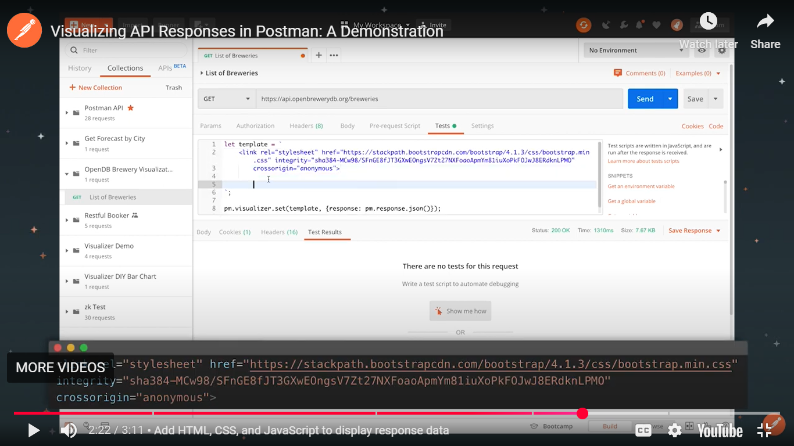
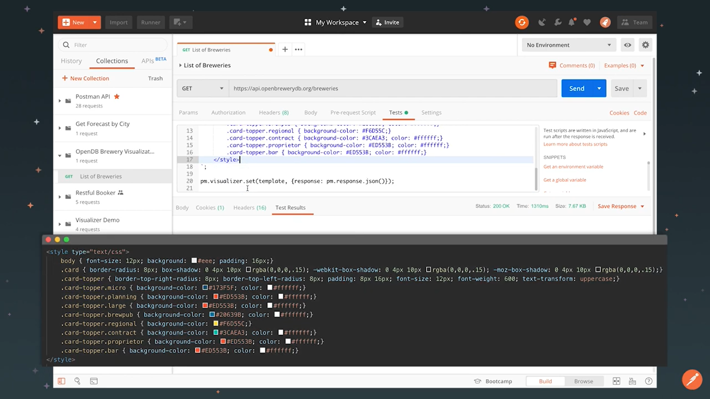
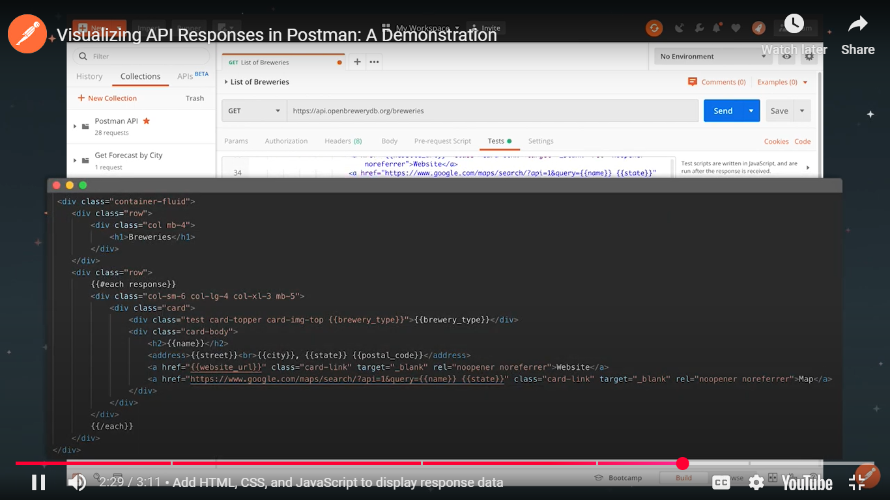
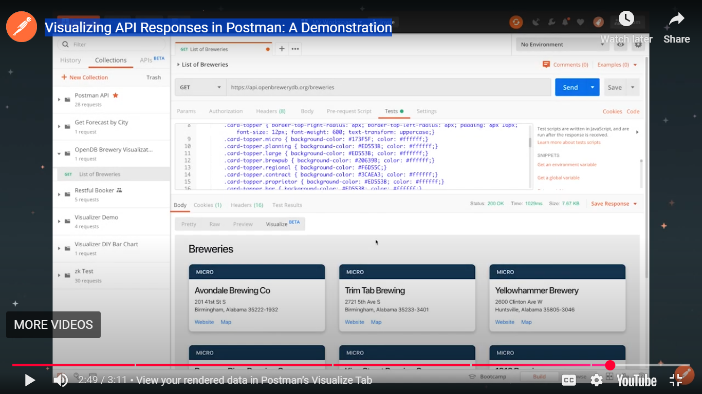

# Postman Notes

## API types

The term API is often used to refer to web APIs, which allow communication between computers that are joined by the internet. While this course will focus on Web APIs, it is important to keep in mind that the term "API" can apply to a broad range of interfaces:

- A hardware API is an interface for software to talk to hardware.
  - Ex: How your phone's camera talks to the operating system.
- A software library API is an interface for directly consuming code from another code base.
  - Ex: Using methods from a library you import into your application.
- A web API is an interface for communicating across code bases over a network.
  - Ex: Fetching current stock prices from a finance API over the internet.

Multiple API types may be used to achieve a simple task. For example, uploading a photo to Instagram makes use of various APIs:

1. Hardware API for the app to talk to your camera
2. Software library API for the image to be processed with filters
3. Web API for sending your image to Instagram's servers so your friends can like it

## API architectures

There is more than one way to build and consume APIs. These are some of the most common architecture types you may come across:

- REST (Representational State Transfer)
- GraphQL
- WebSockets
- webhooks
- SOAP (Simple Object Access Protocol)
- gRPC (Google Remote Procedure Call)
- MQTT (MQ Telemetry Transport)

## API accessibility

APIs also vary in the scope of who can access them:

- Public APIs are made public and can be consumed by anyone
- Private APIs are consumed only within an organization and are not made public
- Partner APIs are consumed between one or more organizations that have an established relationship

Recent developments in API utilization has led to the rise in popularity of microservices, which are ultimately loosely coupled services accessed through public APIs.

## Send requests and view responses

You can interact with the Postman API Platform via Postman's desktop, web, [CLI](https://en.wikipedia.org/wiki/Command-line_interface), and/or API interfaces.

These API client interfaces allow you to easily:

- Manage API data
- Send any [REST](https://en.wikipedia.org/wiki/Representational_state_transfer), [SOAP](https://en.wikipedia.org/wiki/SOAP), and [GraphQL](https://en.wikipedia.org/wiki/GraphQL) queries, inspect the response and debug
- Turn API data into charts and graphs with Postman Visualizer
- Manage API authentication no matter the authentication protocol backing
- Generate code snippets
- Keep track of request history
- Write tests

## Visualize your data

