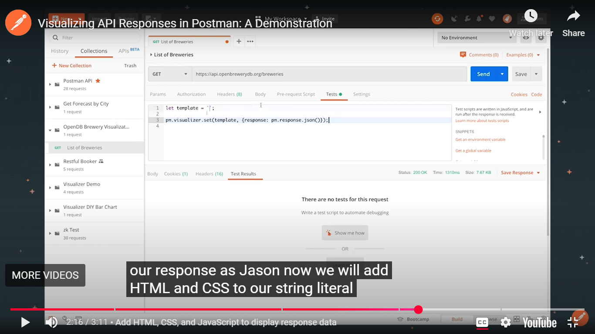

# Postman Notes

## API Beginner Series

> Source: <https://academy.postman.com/path/api-beginner>

### API types

The term API is often used to refer to web APIs, which allow communication between computers that are joined by the internet. While this course will focus on Web APIs, it is important to keep in mind that the term "API" can apply to a broad range of interfaces:

- A hardware API is an interface for software to talk to hardware.
  - Ex: How your phone's camera talks to the operating system.
- A software library API is an interface for directly consuming code from another code base.
  - Ex: Using methods from a library you import into your application.
- A web API is an interface for communicating across code bases over a network.
  - Ex: Fetching current stock prices from a finance API over the internet.

Multiple API types may be used to achieve a simple task. For example, uploading a photo to Instagram makes use of various APIs:

1. Hardware API for the app to talk to your camera
2. Software library API for the image to be processed with filters
3. Web API for sending your image to Instagram's servers so your friends can like it

### API architectures

There is more than one way to build and consume APIs. These are some of the most common architecture types you may come across:

- REST (Representational State Transfer)
- GraphQL
- WebSockets
- webhooks
- SOAP (Simple Object Access Protocol)
- gRPC (Google Remote Procedure Call)
- MQTT (MQ Telemetry Transport)

### API accessibility

APIs also vary in the scope of who can access them:

- Public APIs are made public and can be consumed by anyone
- Private APIs are consumed only within an organization and are not made public
- Partner APIs are consumed between one or more organizations that have an established relationship

Recent developments in API utilization has led to the rise in popularity of microservices, which are ultimately loosely coupled services accessed through public APIs.

## Send requests and view responses

You can interact with the Postman API Platform via Postman's desktop, web, [CLI](https://en.wikipedia.org/wiki/Command-line_interface), and/or API interfaces.

These API client interfaces allow you to easily:

- Manage API data
- Send any [REST](https://en.wikipedia.org/wiki/Representational_state_transfer), [SOAP](https://en.wikipedia.org/wiki/SOAP), and [GraphQL](https://en.wikipedia.org/wiki/GraphQL) queries, inspect the response and debug
- Turn API data into charts and graphs with Postman Visualizer
- Manage API authentication no matter the authentication protocol backing
- Generate code snippets
- Keep track of request history
- Write tests

### Visualize your data




### Response Codes

| Code range | Meaning | Example |
| --- | --- | --- |
| `2xx` | Success | `200` - OK  `201` - Created  `204` - No content (silent OK) |
| `3xx` | Redirection | `301` - Moved (path changed) |
| `4xx` | Client error | `400` - Bad request  `401` - Unauthorized  `403` - Not permitted  `404` - Not found |
| `5xx` | Server error | `500` - Internal server error  `502` - Bad gateway  `504` - Gateway timeout |

### Request URL

In addition to a request method, a request must include a request URL that indicates where to make the API call. A request URL has three parts:

- a **protocol** (such as `http://` or `https://`),
- a **host** (location of the server), and
- a **path** (route on the server)

For example:

| Protocol | Host | Path |
| --- | --- | --- |
| `https://` | `library-api.postmanlabs.com` | `/books` |

Note: Paths and full URLs are also sometimes called API endpoints.

## Query Parameters

Now you know that the minimum ingredients you need to make a request are:

- a request method (`GET`/`POST`/`PUT`/`PATCH`/`DELETE`, etc)
- a request URL

Some APIs allow you to further refine your request with key-value pairs called query parameters. Query parameters are added to the end of the path. They start with a question mark `?`, followed by the key value pairs in the format: `<key>=<value>`.

For example, this request might fetch all photos that have landscape orientation:

`GET https://some-api.com/photos?orientation=landscape`

If there are multiple query parameters, each is separated by an ampersand `&`. In the following example, the two query parameters specify the orientation and size of photos to be returned:

`GET https://some-api.com/photos?orientation=landscape&size=500x400`

### Try it out

You can try pasting the below URL into your browser. You can also use this URL to send a GET request in Postman to make a Google search for "postman". If you use Postman, click the "Preview" tab in the response to view the rendered HTML.

`https://www.google.com/search**?q=postman**`

This request adds a search term as a query parameter `q=postman` ("q" refers to "query" here) to the `GET /search` path on Google's server.

Because this parameter is in our request, the server returns an HTML document that is a search results page with hits for "postman". The search bar is also pre-populated with our query "postman". You can try to change your search directly from the URL by changing the value for the query parameter `q=<something else>`


### When to use query parameters?

The answer is always: read the API documentation!

Sometimes query parameters are optional and allow you to add filters or extra data to your responses. Sometimes they are required in order for the server to process your request. APIs are implemented differently to fulfill different needs.

## Path parameters

In the [Requests and responses - Basics](/path/api-beginner/requests-and-responses-basics-2212) module, we learned about query parameters which allowed us to pass request data to the API to filter the results.

Another way of passing request data to an API is via **path parameters**. A path parameter (or "path variable") is a dynamic section of a path, and is often used for IDs and entity names such as usernames.

Path parameters come immediately after a slash in the path. For example, the [GitHub API](https://docs.github.com/en/rest/reference/users#get-a-user) allows you to search for GitHub users by providing a username in the path in place of `{username}` below:

`GET https://api.github.com/users/{username}`

Making this API call with a value for `{username}` will fetch data about that user:

`GET https://api.github.com/users/postmanlabs`

You can have multiple path parameters in a single request, such as this endpoint for getting a user's GitHub code repository:

`GET https://api.github.com/repos/{owner}/{repoName}`

For example, to get information about the `newman` code repository from `postmanlabs`:

`GET https://api.github.com/repos/postmanlabs/newman`

### Path vs. query parameters

At first, it is easy to confuse these two parameter types. So, let's compare them side by side.

|     |     |     |
| --- | --- | --- |
|     | Path parameters | Query parameters |
| Example | `/books/abc123` | `/books?search=borges&checkedOut=false` |
| Location | A path parameter can be located directly after a slash anywhere in the path. | A query parameter can be located only at the end of a path, right after a question mark `?` |
| Value types | A path parameter accepts dynamic values | A query parameter accepts pre-defined query keys with dynamic or static values. |
| Typical use cases | A path parameter is often used to identify an entity by its ID or name. | A query parameter is often used to specify options and filters that further refine the results. |

Keep in mind that these are just conventions. Some APIs might ask you to pass an ID or username in a query parameter like this: `/users?username=getpostman`

### When to use path parameters?

Always read the API documentation. If a path parameter is required, the documentation will mention it.

Note that some API documentations use "colon syntax" to represent a path parameter, like `/users/:username`, while some use curly braces like `/users/{username}`. They both mean the same thing: that part of the path is dynamic.

### Example of path parameter: get book by id

Imagine that someone keeps coming into the library every day asking whether "Ficciones" by Jorge Luis Borges is available

When you fetched all the books in the library, you may have noticed that each book has a unique `id` value. This `id` can always be used to identify the book, even if its other properties are changed.

Since this person keeps asking about "Ficciones", you've written down that the unique `id` for this book is `29cd820f-82f9-4b45-a7f4-0924111b5b89`

Want to see it for yourself? Just search for "Ficciones" with the `search` query parameter: `GET /books?search=ficciones`

According to the [Postman Library API v2 documentation](https://documenter.getpostman.com/view/15567703/UVyxRtng#b042476f-a942-497d-af90-b014f5c4a4ce), we can get a specific book by sending a `GET` request to the path `/books/:id`, where we replace `:id` with the book's id.

1. Hover on your Postman Library API v2 Collection, click the **three dots icon** and select **Add request.** Name your new request **"**get book by id**"**
2. Make sure the request method is set to `GET`, and paste in this endpoint as the request URL: `https://library-api.postmanlabs.com/books/:id`.

    Postman automatically adds a _Path Variables_ editor in the _Params_ tab of the request for any path parameters in the request URL prefixed with a colon `:`.

    

3. In the _Params_ tab of the request, paste the `id` for "Ficciones" (`29cd820f-82f9-4b45-a7f4-0924111b5b89`) as the _value_ for the parameter named `id`. Make sure not to add any whitespace around the id value.

    

4. **Save** your request.
5. **Send** your request.

You should get a `200 OK` response with a single JSON object that represents the "Ficciones" book. At the time of this example, the book is not checked out:


## Add authorization to the Collection

You can pass auth details along with any request you send in Postman. Auth data can be included in the header, body, or as parameters to a request. If you enter your auth details in the **Authorization** tab, Postman will automatically populate the relevant parts of the request for your chosen auth type.

The Postman Auth helper can help you add authorization at the request, folder or collection level. By default, requests inside the collection or folder will inherit auth from the parent, which means that they'll use the same auth that you've specified at the folder or collection level. To change this for an individual request, make a different selection in the request **Authorization** tab.

Let's add the api-key to our entire collection so that all requests will send the key!

1\. Click on your collection **Postman Library API v2** and select the **Authorization** (or **Auth**) tab.

  
  
2\. For _Type_ click the dropdown and select **API Key**.


3\. Enter the API Key details in the fields below. _Key_**: `api-key`,** _Value_**: `postmanrulz`**, _Add to_**: Header**.


4\. **Save** the changes to your collection by clicking the floppy disk icon in the upper right.


Now all requests inside this collection that use the auth method “Inherit from parent” will have this header attached, and therefore be authorized.

## Variables

Postman allows you to save values as variables so that you can:

1. Reuse values to keep your work - Don’t Repeat Yourself (DRY)
2. Hide sensitive values like API keys from being shared publicly

### Variable scopes

You can set variables that live at various scopes. Postman will resolve to the value at the nearest and narrowest scope. In order from broadest to narrowest, these scopes are:

- Global
- Collection
- Environment
- Data
- Local

We will work with collection variables today, which are variables that live at the collection level and can be accessed anywhere inside the collection.

### Variable syntax

Once a variable is defined, you can access its value using double curly brace syntax like this:

`{{variableName}}`

In the next section we will learn how to add variables to our collection to introduce better practices and allow us to make dynamic requests.

### Set the baseUrl variable

Notice that we use the same base URL for all requests to the library API. We can simplify our requests by replacing `https://library-api.postmanlabs.com` with a variable called `{{baseURL}}`

One way to set a variable is to highlight the input text you'd like to convert into a variable, and follow the **Set as variable** popup instructions.

1. Go to the first _"get books"_ request in your collection.

    2\. With your cursor, select the entire base URL of the API (`https://library-api.postmanlabs.com`). Do not include the slash `/` after `.com`. Click **Set as variable** to save the base URL to a variable.

    

    3\. Click **Set as a new variable**.

    

    4\. Name your new variable _“_baseUrl_”_ and select **Collection** as the scope, then click **Set variable**.

    

    5\. Hover over `{{baseUrl}}`. You will see its current value is set to `https://library-api.postmanlabs.com`.

    

6\. Now you can send your request and see that it works just like before. You should get a status `200 OK` response with a list of books.

### Where are my variables?

You can find Collection variables on your collection. Select the **Postman Library API v2** collection, then click the **Variables** tab. Here you can view and edit your variables.


Note that there are two columns:

- _INITIAL VALUE_ - the value initially set when someone forks or imports your collection. Note that this is public so don't put any secrets here.
- _CURRENT VALUE_ - Postman always resolves the variable to this value. This is local to your Postman account, and not public. It is good to keep secrets like API Keys ONLY in this column and not include in the Initial Value column.

### Update all your requests to use `{{baseUrl}}`

Now that the variable is set, you can access the value anywhere in your collection by typing `{{baseUrl}}`.

1. Set all your requests to use `{{baseUrl}}` to replace `https://library-api.postmanlabs.com` (before the slash `/`).

    

2. Be sure to **Save** each request after the change.

Postman gives you the ability to add automations and dynamic behaviors to your collections with scripting. Any Node.js code in the _Tests_ tab of a request will be executed after a response comes back from the API. If you are new to Node.js and JavaScript - have no fear! Node.js is a runtime environment for executing JavaScript code outside of a web browser.

### Logging data

In JavaScript, you can print data for a value to the console using the following syntax:

```javascript
console.log("Hello world!")
// => Hello world!
```

### Comments

In JavaScript, you can add comments to your code. Comments are skipped by the interpreter, so you can use them to explain things in your code if you like.

```javascript
// Single line comments start with two slashes. I am not code!

/* You can write multi-line comments by 
opening and closing with slash and asterisk. 
I am not code!
*/
```

### Add a script to your request

1\. In your _"add a book"_ request, change the book data in your **Body** to a new book you like.

2\. Open the **Scripts** tab of the request and select the **Post-res tab** (short for Post-response):


3\. Inside the Tests editor, add this JavaScript code to log the JSON response from the API:

```javascript
console.log(pm.response.json())
```


4\. **Save** your request.

5\. **Send** your request. This will trigger the script in the Tests tab to run after the response comes back from the API

6\. Open the **Postman Console** in the lower left of the window:


7\. Scroll to the bottom of the logs in the console. You will see your most recent request `POST https://library-api.poistmanlabs.com/books`. The response data from the API is logged in the console because of the code in our **Tests** tab. You can expand the data by clicking on the small arrow to the left:


## Scripting in Postman

### The `pm` object

Postman has a helper object named `pm` that gives you access to data about your postman environment, requests, responses, variables and testing utilities.

For example, you can access the JSON response body from the API with: **`pm.response.json()`**

### Setting and getting collection variables

The `pm` object allows you to set and get collection variables.

To set a collection variable use the `.set()` method with the variable name and the variable value parameters:

```javascript
pm.collectionVariables.set("variableName", value)
```

To get a collection variable use the `.get()` method and specify the name of the variable you want to retrieve:

```javascript
pm.collectionVariables.get("variableName")
```

### Local variables

We can also store local variables inside our scripts using JavaScript.

There are two ways to define a variable in JavaScript: using the `const` or `let` keywords.

### Set the new book id as a variable

Saving a value as a variable allows you to use it in other requests. Let's grab the `id` of a newly added book and save it so we can use it in future requests.

1. In the **Body** tab of the _"add a book"_ request, change the details to yet another new book to add.
2. In the **Scripts** tab of the _"add a book"_ request, replace the console.log() statement with this code:

    ```javascript
    const id = pm.response.json().id
    pm.collectionVariables.set("id", id)
    ```

    This first line assigns the `id` value from the API response to a local variable named `id`. This variable is `const` because the variable value doesn't change in the script. The second line sets this value to a collection variable called `id`.

    
3. **Save** your request
4. **Send** your request. When the `201` response comes back from the API with you newly created book, the Tests script will run and save the book's `id` as a collection variable automatically.
5. View your collection variables by clicking on your **Postman Library API v2** collection, then the **Variables** tab. The `id` variable has been automatically assigned the id of your new book as its Current Value! You can now use `{{id}}` anywhere in your collection to access this value.

    

## PATCH request: Check out a book

code{ font-weight: normal; }

Someone wants to check out the book you just added. As librarian, you will update the library database via the API to mark the book's `checkedOut` status from `false` to `true`.

The [API documentation](https://documenter.getpostman.com/view/15567703/UVyxRtng#1c3ce860-e1ee-4957-b517-2e3068021abc) allows updating a book by id by making an authorized request with the updated information to: `PATCH https://library-api.postmanlabs.com/books/:id`

1. Hover on your **Postman Library API v2** collection, click the three dots, and select **Add request**. Name your new request _"checkout a book"_.
2. Set the request method to **PATCH** and the request URL to `{{baseUrl}}/books/:id`

    
3. Set the value of path variable `id` to `{{id}}`. This will use the value of our collection variable named `id` that was set in the script of the _"add a book"_ request.

    
4. Add a raw JSON body in the **Body** tab for updating the `checkedOut` property to `true`:

    ```javascript
    { 
      "checkedOut": true 
    }
    ```

    
5. Make sure in the **Authorization** tab that the Auth type is set to _"Inherit from parent"_. This will use the API Key set at the collection level on our PATCH request.

    
6. **Save** your request.
7. **Send** your request.

You should get a `200 OK` response that shows the updated data about your book. Notice how `checkedOut` is now `true`


Now if you return to your _"get book by id"_ request, update the id path variable value to `{{id}}` , **Save** and **Send**, you will see the same updated data.


## DELETE: Delete a book

code{ font-weight: normal; }

Oops! The person that checked out your book accidentally lost it... you will need to delete it from the library database. The API documentation shows that books can be deleted with the `DELETE /books/:id path`

The `DELETE` request has a similar format to the `PATCH` request, so let's copy the `PATCH` request to make our new request.

1. Hover over your _"checkout a book"_ request, click the three dots icon, then select **Duplicate** to create a copy of the request. Rename your new request _"delete a book"_.

    
2. Set the request method of the _"delete a book"_ request to `DELETE`.
3. Make sure the request **Body** is empty. This endpoint does not require a body.
4. In the **Params** tab, make sure the path variable id is set to `{{id}}`. Your request should now look like this:

    
5. **Save** your request.
6. **Send** your request.

You should get a `204 No Content` response from the API. This means the server successfully deleted the book, and won't send any response body back. Remember: if you ever wonder what a status code means, you can hover on it in Postman for an explanation.


Is it really gone? Without changing anything, try sending your request again. Since you are sending a request to delete a book with an id that no longer exists, you get a `404` error.


## Intro to Postman - Notes on Youtube Playlist by Postman

> Source: <https://www.youtube.com/playlist?list=PLM-7VG-sgbtAgGq_pef5y_ruIUBPpUgNJ>

## Intro to Postman | Part 2: Authorize a Request

- This video series is for people new to Postman.
- The focus of this video is on how to **authorize a request in Postman**.
- Not all APIs can be accessed without providing **credentials**.
- The API needs to know who you are and check if you are allowed to access or change data.
- The example API used is the **GitHub API**.

### Using the GitHub API to Create a Repository

- The video uses the GitHub API documentation to figure out how to create a new repository.
- The goal is to create a repository **for the authenticated user**.
- The endpoint for this action is `/user/repos`.
- This request needs to be a **POST request**.
- The base URL for the GitHub API is `api.github.com`.

### Attempting the Request Without Authorization

- In Postman, create a new tab and paste the base URL `api.github.com`.
- Select `POST` from the dropdown menu.
- Add the endpoint `/user/repos`.
- Sending the request without providing any body initially results in a `401 Unauthorized` status code.
- **401 Unauthorized** means you are not authorized because credentials haven't been provided.
- It doesn't make sense for GitHub to create a repository if it doesn't know who you are.

### Authentication Using Tokens

- When working with APIs, usernames and passwords are not typically used.
- **Tokens** are used instead; they are a form of a temporary password.
- Tokens sometimes provide limited access to an account.

### Creating a Personal Access Token on GitHub

- To get a token, go to `github.com`.
- From your GitHub profile, navigate to **Settings**.
- In Settings, go to **Developer settings**.
- Select **Personal access tokens**.
- Click on **Generate new token**.
- Provide a **note** for the token (e.g., `postman`) which is important for later knowing why the token was created.
- Select a low **expiration date** (e.g., 7 days) so the token expires and becomes unusable.
- Select **scopes**, which tie permissions to the token.
- By default, usernames/passwords have full access, but for this task, only the necessary permissions are needed.
- To create a repository, only the **`repo` scope** is selected.
- Scroll down and click **Generate token**.
- **Copy the generated token**. (Note: The token shown in the video is invalidated after recording).

### Using the Token in Postman for Authorization

- Postman offers **authentication helpers**.
- These are built-in tools to make authorization easier.
- In the Postman request tab, below the URL, select the **Authorization** tab.
- From the dropdown list, select **Bearer Token**.
- Paste the copied token into the token field.
- Click **Send**.
- The status code is now `400 Bad Request` instead of `401 Unauthorized`. This indicates that authentication is working.
- The response message states that the body should be a JSON object.

### Saving the Request

- Since progress is being made, it's recommended to save the request.
- Create a new collection (e.g., `github api`).
- Save the request with a name (e.g., `create repository`).

### Handling Sensitive Data: Using Variables

- It's **not a good idea** to put sensitive data like tokens directly into the request fields, especially if sharing the collection.
- The concept of **variables** is introduced to handle this.
- Select the token value in the authorization tab.
- An option **Set as a new variable** appears. Click this.
- Name the variable (e.g., `token`).
- Select the **scope** as **Collection**. (The request must be saved in a collection first to see the collection scope option).
- Click **Set variable**.
- Hovering over the variable name in the request now shows the saved value.
- Postman uses a specific syntax for variables inside requests: **double curly brackets** `{{variableName}}`.

```bash
{{token}}
```

- Sending the request with `{{token}}` in the token field still works, confirming the variable is being replaced correctly by Postman.

### Managing Collection Variables

- To make changes to a collection variable, open the collection's context menu and select **Edit**.
- Go to the **Variables** tab within the collection settings.
- Variables have an **Initial Value** and a **Current Value**.
- The **Initial Value** is what will be shared with others if the collection is exported.
- It is recommended to put a placeholder like "put your token" in the Initial Value so recipients know they need to replace it with their own token.
- The **Current Value** is private to your account and is what Postman uses when sending requests.
- It is safe to keep your actual, valid token in the Current Value.
- Click **Save** after making changes to variables.
- The request in the tab still works correctly after saving the variable.

### How Bearer Token Authorization Works (Headers)

- The **authorization helper** in Postman for Bearer Token creates a new **header**.
- Go to the **Headers** tab in the request.
- A header named `Authorization` is added.
- The value of this header is `Bearer` followed by the token (or the variable `{{token}}`).

```bash
Authorization: Bearer {{token}}
```

- **Headers** are another way to pass data to an API.
- Headers are generally not directly connected to filtering endpoint data (query parameters are used for that).
- Headers are used for things like **authentication information** or data useful for ensuring the message is delivered and understood properly.
- Tokens are most commonly passed in headers for authorization purposes.

### Providing the Request Body

- The previous `400 Bad Request` error indicated the body was missing or invalid.
- Go back to the API documentation to find out what needs to be sent in the body.
- The documentation states the information should be formatted as **JSON**.
- Looking at the parameters, `name` is the **only required parameter**.
- Other optional parameters like `description` can also be submitted.
- These parameters are expected to be part of the **request body**.
- In Postman, select the **Body** tab.
- Choose the **raw** option.
- From the format dropdown, select **JSON**.
- Create a valid JSON object with the required `name` parameter and an optional `description`.

```json
{
  "name": "Created from Postman",
  "description": "All right"
}
```

- Click **Send** again.
- This time, the status code is **`201 Created`**.
- **201 Created** means a new resource (the repository) has been successfully created.
- The response body contains details about the newly created repository (ID, name, URL, etc.).
- The new repository can be verified on the GitHub profile web interface.

### Troubleshooting Common Beginner Errors

- When encountering errors, it's important to look at the **status code** to understand the type of error.
- Also, look for hints in the **response body**.
- **`400 Bad Request`**: Something is wrong with the request itself.
  - Example: Not providing a body when required. The hint might say "body should be a JSON object".
  - Example: Providing an invalid JSON format. Postman might try to help, but the error could be "problems parsing json".
- **`404 Not Found`**: The address (URL) is incorrect.
  - Example: An extra space in the URL makes it a different, non-existent address.
- **`401 Unauthorized`**: The bearer token is not configured correctly or is invalid.
  - Check for extra spaces or unwanted characters in the token value.
- For further troubleshooting, check the video description, post a comment, or post a question in the Postman community.

Here are detailed markdown notes from the provided video transcript excerpts on writing API tests in Postman:

## Intro to Postman | Part 3: Write API Tests

- This video is part of a series for people new to Postman.
- The focus is on how to **write your first API tests in Postman**.
- Previous videos covered building requests and inspecting responses manually.

### What is API Testing?

- You have already been doing a basic form of API testing by building requests and inspecting the response body and status code manually to see if calls were successful.
- This manual process is time-consuming and prone to errors, especially with multiple requests.
- **Automated API testing** involves writing code in Postman that automatically checks if relevant criteria have been fulfilled.
- Postman allows both manual testing and automating the process.
- Automated checks can significantly speed up testing (e.g., checking 100 endpoints in 10 seconds).

### Writing Your First Test in Postman

- The first step to automating tests in Postman is to write a test.
- Tests are written in the **Tests tab** of a request.
- Postman provides a **snippets panel** on the right side of the Tests tab which is great for beginners to get started.

### Adding a Status Code Test

- Select a snippet like **"Status code is 200"**.
- This generates JavaScript code in the Tests tab.
- The code uses the `pm.test` function.
- The `pm.test` function takes two parameters: the name of the test (e.g., "Status code is 200") and a callback function containing the **assertions**.
- The assertion generated by the snippet is `pm.response.to.have.status(200)`.
- This test code is executed _once the response from the server has been received_.
- Assertions are made on the response using the **`pm` object**.

```javascript
pm.test("Status code is 200", function () {
    pm.response.to.have.status(200);
});
```

### Running the Test and Handling Failure

- Running the request with the initial snippet (expecting 200) after creating a repository might result in a **`422 Unprocessable Entity`** status code because a repository with the same name already exists.
- The **Test Results** section will show the test failing.
- The failure message will indicate what was expected (status 200) and what was received (status 422).

### Importance of Failing Tests

- It is **very important to ensure that your tests will fail** if the condition is not met.
- If a test passes from the beginning, you should deliberately change something to make it fail to confirm it's working correctly.
- A common beginner mistake is to incorrectly format the `pm.test` function, often by closing the function or removing necessary parts, which can result in a test that _always passes_ because it contains **no assertions**.

```javascript
// Example of a common beginner mistake that results in a test with no assertions
pm.test("Status code is 200", function () {
    // Missing assertion here
}); // Parenthesis might be misplaced or content inside the function missing
```

- Always ensure your test fails when it should before trusting that it passes when it should.

### Fixing the Status Code Test for Repository Creation

- When creating data via an API, the expected successful status code is often **`201 Created`**.
- The API error message indicates the repository name already exists, requiring a change to the request body's `name` property.
- Update the test to expect status code **`201`** by changing both the test name and the assertion.

```javascript
pm.test("Status code is 201", function () {
    pm.response.to.have.status(201);
});
```

- After changing the repository name in the request body and updating the test to expect `201`, the test should pass upon sending.

### Testing Response Body Properties

- Testing only the status code may not be sufficient; a `201` status doesn't guarantee the data created is exactly what was intended (e.g., the name or description might be incorrect).
- You can write tests to check specific properties returned in the response body.
- Use the snippet **"Response body: JSON value check"**.
- This snippet provides code to:
    1. Get the response body as a JavaScript object.
    2. Write an expectation using `pm.expect`.

```javascript
pm.test("Your test name", function () {
    var jsonData = pm.response.json();
    pm.expect(jsonData.value).to.eql(100);
});
```

- **Explanation of the code:**
  - `var jsonData = pm.response.json();` : This line parses the JSON response body into a JavaScript object, making its properties accessible.
  - `pm.expect(jsonData.value).to.eql(100);` : This is the assertion. It expects the property `value` within the `jsonData` object to deeply equal `100`.

### Modifying the JSON Body Test

- Based on the repository creation example, you might want to check if the `description` provided in the request body is present and correct in the response body.
- The initial snippet might fail because the expected property (`value`) doesn't exist in the response, resulting in `undefined`, and the expected value (`100`) is incorrect.
- Modify the assertion to check the `description` property and compare it to the expected string value.

```javascript
pm.test("Description is correct", function () { // Changed test name
    var jsonData = pm.response.json();
    pm.expect(jsonData.description).to.eql("All right"); // Checking 'description' property against the expected string
});
```

- Running the request with both the `201` status code test and the description test should show both tests passing if the response body contains the expected description.
- You can check other properties from the response body by inspecting the received JSON and modifying the assertion accordingly.

### Handling Dynamic Data: Using Variables in Scripts

- **Hard-coded data**, like the repository name in the request body, is annoying because it needs to be changed manually for each request to create a unique repository.
- **Dynamic data** is needed to solve this.
- Postman variables can be used, but for values that change _before_ the request runs, they need to be set in a **pre-request script**.
- **Pre-request scripts** run _before_ the request is executed.
- **Test scripts** run _after_ the response is received.
- To set a Postman variable from a script, use `pm.collectionVariables.set()` (or `pm.environmentVariables.set()`, etc.).
  - The first argument is the variable name (e.g., `"repositoryName"`).
  - The second argument is the value to set.

```javascript
// In the Pre-request Script tab
pm.collectionVariables.set("repositoryName", "test value"); // Example setting a static value
```

- Use the variable in the request body using the `{{variableName}}` syntax.

```json
{
  "name": "{{repositoryName}}",
  "description": "All right"
}
```

- Sending the request will now use the value set by the pre-request script in the body. This alone is not dynamic randomness, but it shows the variable concept works.

### Adding Randomness to the Repository Name

- To make the repository name dynamic, add randomness in the pre-request script.
- Define a JavaScript variable (using `const` or `var`) to hold a random string. **Do not confuse these JavaScript variables with Postman variables**.
- A built-in JavaScript function can be used to generate a random string.

```javascript
// In the Pre-request Script tab
const randomString = Math.random().toString(36).substring(7); // Example generating a random string
```

- Combine a base name with the random string to create a unique repository name.
- Set a **Postman variable** (like `repositoryName`) using `pm.collectionVariables.set()` with the combined dynamic string as the value.

```javascript
// In the Pre-request Script tab
const randomString = Math.random().toString(36).substring(7);
const repoName = "my repository " + randomString; // Combine base name and random string

// Set the Postman collection variable
pm.collectionVariables.set("repositoryName", repoName);
```

- Ensure you are passing the JavaScript variable `repoName` (without quotes) to `pm.collectionVariables.set()`, not the string `"repoName"`.
- Now, each time the request is sent, the pre-request script generates a unique name, and the request body uses this dynamic value via the `{{repositoryName}}` variable.

### Testing the Dynamic Repository Name

- Add another test in the Tests tab to verify that the repository name returned in the response matches the name that was dynamically generated and sent in the request.
- Copy an existing test snippet.
- The test should compare the `name` property from the response JSON (`jsonData.name`) to the value of the `repositoryName` Postman variable.
- **Important:** You cannot use the `{{variableName}}` syntax _inside scripts_ (Pre-request or Tests).
- To access the value of a Postman variable _inside a script_, use the `pm.collectionVariables.get()` method.
  - Provide the variable name as a string argument (e.g., `"repositoryName"`). **Do not include curly brackets**.

```javascript
// In the Tests tab
pm.test("Repository name is correct", function () { // Changed test name
    var jsonData = pm.response.json();
    // Get the generated repository name from the collection variable
    const expectedName = pm.collectionVariables.get("repositoryName");

    pm.expect(jsonData.name).to.eql(expectedName);
});
```

- Running this test initially might fail because GitHub's API often replaces spaces in repository names with dashes. The returned name will have dashes, while the value retrieved from the Postman variable still has spaces.
- To make the test pass, use a string function like `replaceAll()` on the expected name (retrieved from the variable) to replace spaces with dashes before comparing.

```javascript
// In the Tests tab
pm.test("Repository name is correct", function () {
    var jsonData = pm.response.json();
    const generatedName = pm.collectionVariables.get("repositoryName");

    // Replace spaces with dashes in the generated name to match GitHub's behavior
    const expectedName = generatedName.replaceAll(" ", "-"); // Using replaceAll

    pm.expect(jsonData.name).to.eql(expectedName);
});
```

- With this adjustment, the test for the repository name should pass.

### Summary of Testing

- By writing tests, you replace manual checks with automated assertions.
- Examples include checking the status code and properties from the response body.
- You only need to look at the **Test Results** to know if the request worked as expected.
- Tests also serve as documentation for the API's functionality (e.g., noting that spaces in names are replaced with dashes). If the API behavior changes, the test will fail, indicating the change.
